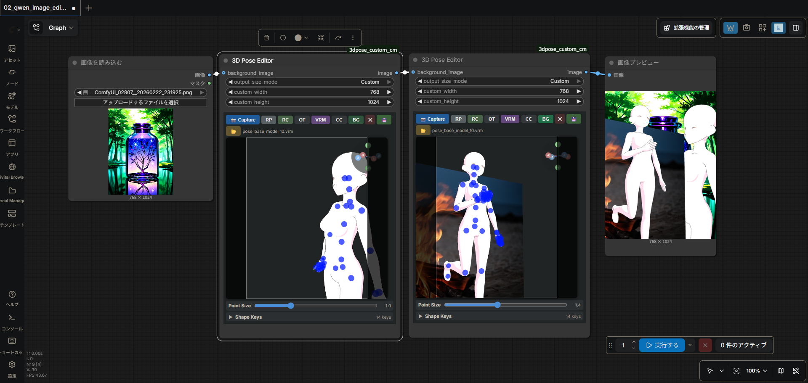
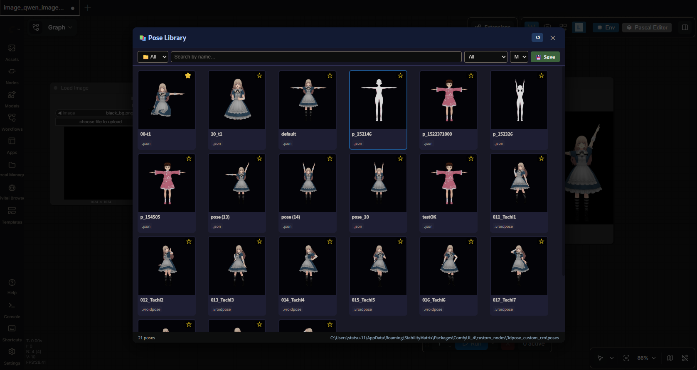
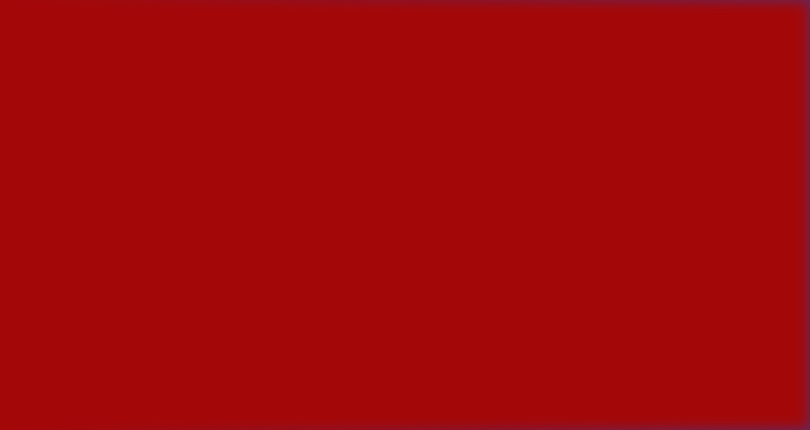

# 3D Pose Editor — ComfyUI Custom Node

An interactive 3D pose editor node for ComfyUI.  
Load VRM / GLB / GLTF models directly in the browser, drag bones to pose them, animate poses/camera/lights on a keyframe timeline, and output the result to your workflow.

ComfyUI 上で動作するインタラクティブな 3D ポーズエディタノードです。  
VRM・GLB・GLTF モデルをブラウザから直接読み込み、ボーンをドラッグ操作してポーズを付け、キーフレームタイムラインでポーズ・カメラ・ライトをアニメーションさせ、そのままワークフローに出力できます。

---

## English

### Features / Buttons

**Row 1** (capture / timer / camera / model)

| Button | Function |
|--------|----------|
| 📸 Capture | Send current pose as PNG to node output |
| ⏱ | Timer capture toggle — auto-captures every `timer_interval` seconds |
| RC | Reset camera |
| OT / PR | Toggle Orthographic / Perspective camera |
| VRM | Load VRM / GLB / GLTF file from local disk |
| VRMA | Load a `.vrma` animation and play it back on the current VRM (see [VRMA Animation Playback](#vrma-animation-playback-vrma) below) |
| CC | Color correction ON/OFF (sRGB + ACES Filmic) |

**Row 2** (Light & Pose Editor / background / pose file)

| Button | Function |
|--------|----------|
| 💡 Light | Open the **Light & Pose Editor** on its Light tab (see below) |
| 🕺 Pose | Open the **Light & Pose Editor** on its Pose tab (see below) |
| BG | Load background image from local disk |
| ✕ | Clear background image **and** background color |
| 🎨 | Scene background color picker |
| ⬇️ | Download current pose as JSON file |
| 💾 | Save current pose to `poses/` folder |
| 📂 | Load pose file (.json / .vroidpose) |

**Row 3** (look-at / spring bone / pose)

| Button | Function |
|--------|----------|
| 👁 | Toggle LookAt target — when ON, drag the cyan marker in the 3D view to steer the eyes/head (no effect if the model has no LookAt data) |
| 🎐 | Toggle spring bone physics (hair, skirts, etc.) — turning OFF freezes the current sway state |
| 🌬 | Toggle a breeze wind effect on the spring bones (hair, skirts, etc.) — strength / direction / gustiness are adjusted in the Light & Pose Editor; has no effect while 🎐 is OFF |
| 🧭 | Toggle the wind source marker — when ON, drag the orange cone in the 3D view to set the wind direction (same operation as the LookAt marker); while ON, the "direction" slider in the Light & Pose Editor is disabled |
| RP | Reset pose — also available inside the Light & Pose Editor's keyframe panel |
| ↔ | Mirror pose (flip left ↔ right) |

**Row 4** (file name)

Displays the name of the currently loaded VRM / GLB / GLTF file.

#### LookAt Target (👁)

When enabled, a cyan marker appears in the 3D view and the model's eyes/head automatically track its position. Drag the marker to steer the gaze. Resetting/loading a pose or mirroring re-anchors spring bones so nothing jumps unexpectedly. The marker itself is never captured in the output image.

#### Spring Bone Physics (🎐)

Toggles the sway-bone simulation (hair, skirts, etc.) defined on the VRM. Turning it OFF freezes the sway at its current state instead of resetting to rest pose. On Reset Pose / Load Pose / Mirror, the spring bone internal state is re-anchored to the new pose so it doesn't snap unnaturally right after the switch.

#### Wind Effect (🌬) and Wind Source Marker (🧭)

Adds a gentle breeze to the spring bones (hair, skirts, etc.) on top of the model's own gravity, using a sum of sine waves so the strength and direction gently drift over time instead of blowing in one fixed direction. Since three-vrm has no built-in wind API, this is implemented by overwriting each spring bone joint's `gravityDir`/`gravityPower` every frame with "the model's original gravity vector + the current wind vector" (the vendor `three-vrm` module itself is never modified). Has no effect while 🎐 Spring Bone Physics is OFF (the joint physics loop itself is paused).

- **🌬 Wind**: master ON/OFF toggle. Strength, direction, and gustiness are adjusted with the sliders in the Light & Pose Editor's Light tab → **E** (Environment) sub-tab, "Wind" section.
- **🧭 Wind Source Marker**: when ON, an orange cone marker appears in the 3D view, using the exact same drag mechanism as the 👁 LookAt marker. The wind direction is computed as the direction from the marker toward a fixed reference point near the model, so you can steer the wind (including vertical components) just by dragging the cone. While ON, the "direction" slider in the Light & Pose Editor is disabled since the marker takes over. The marker is never captured in the output image.

### Light & Pose Editor (💡 / 🕺)

A single modal that combines what used to be three separate windows (Light Editor, Pose Library launcher, VRMA Timeline Editor) into one, so switching between lighting work and pose/animation work no longer means jumping between differently-shaped dialogs.

- Click **💡 Light** or **🕺 Pose** on the node to open it directly on the corresponding tab.
- The header holds the **💡 Light / 🕺 pose** tab switcher, a **Point Size** slider (same control as the node's own Point Size slider below the canvas — moving either one updates the bone-handle marker size; the node's slider is re-synced when the modal closes), and a **📚 Library** button whose role depends on the active tab (see below).
- The center pane embeds the **actual WebGL canvas** (not a copy), scaled to fit — bone dragging, camera orbit, and light-helper dragging all work natively inside the modal exactly as on the node.
- A **keyframe timeline panel** is docked at the bottom and shared by both tabs — see [Keyframe Timeline](#keyframe-timeline-pose--camera--shape-keys) below.

#### Light tab

The left pane has three sub-tabs:

| Sub-tab | Contents |
|---------|----------|
| **L** — Lights | The light list (add/remove/rename lights) and, on the right, a **Properties** panel for the selected light: type (☀ Sun / 💡 Point / 🔦 Spot / ▭ Box RectArea / 🌐 Ambient), color, intensity, position XYZ, target XYZ (Directional/Spot), angle & penumbra (Spot), distance & decay (Point/Spot), shadow (Directional only) |
| **E** — Environment | Ground plane, background wall, shadow quality, and the **🌬 Wind** controls described above |
| **S** — Settings | 🖱 Ctrl+Right-drag zoom toggle (see [Camera Controls](#camera-controls)) and 🖼 anti-aliasing enhancement (supersampling) toggle |

On the **L** sub-tab, **📚 Library** toggles a light-preset library panel — see [Light Library](#light-library-) below. Drag the yellow sphere in the preview to reposition a light in 3D.

#### Pose tab

- Left pane: **Shape Keys** — sliders (0.0 – 1.0) for every morph/expression on the model, updated in real time. This replaces the old collapsible "Shape Keys" panel that used to live at the bottom of the node.
- Right pane: a **Properties** panel reserved for future per-selection details. It's currently a placeholder — kept at the same width as the Light tab's Properties panel purely so the dialog doesn't change size when you flip between the Light and Pose tabs.
- **📚 Library** opens the [Pose Library](#pose-library-) instead of a preset panel.

### Keyframe Timeline (Pose · Camera · Shape Keys)

Docked at the bottom of the Light & Pose Editor (visible on both tabs), this panel lets you build a short animation by placing keyframes on a frame-based timeline, then preview it, save it, or render it out as `.vrma` / WebM / GIF.

| Control | Function |
|---------|----------|
| ✚ Add/Update KF | Add a pose keyframe at the current frame from whatever is currently posed (or overwrite the one already there) |
| − Delete KF | Delete the pose keyframe at the current frame |
| 📚 + From Library | Pick a saved pose from the Pose Library and add it as a keyframe at the current frame |
| 📷 + Cam KF | Add a camera keyframe at the current frame (position, orbit target, up vector, FOV) |
| 📷 − Cam KF | Delete the camera keyframe at the current frame |
| 🔀 Move | While ON, drag a marker on the timeline to move it to a different frame (dropping it on an occupied frame overwrites that frame) |
| ⏮ ❮ *frame* / *total* ❯ | Jump to frame 0 / step back one frame / current frame and total length / step forward one frame |
| FPS | Playback frame rate used for both preview and `.vrma` time conversion (`time = frame / fps`) |
| 🆕 New | Clear the entire timeline (poses, camera, shape keys) and start over |
| 💾 Proj | Save/load the whole timeline as a named project on the server (`.kf_projects/`) |
| RP / RC | Reset pose / reset camera — same as the node's own RP/RC buttons |
| ▶ / ⏸ | Play/pause the timeline. Plays from the current frame through the last frame and loops back to 0, regardless of whether any pose keyframes exist |
| 💾 Save .vrma | Export the pose keyframes as a `.vrma` file and save it server-side into `poses/` (it then shows up in the Pose Library) |
| 🎬 WebM | Render every frame of the full timeline (pose + camera + shape keys) and download it as a WebM video |
| 🎞️ GIF | Render every frame of the full timeline and download it as a transparent GIF |

The timeline marker color shows what's on that frame: **green** = pose + camera, **yellow** = pose only, **purple** = camera only.

Shape-key values can be bundled onto a pose keyframe automatically (whatever the Shape Keys sliders currently show gets saved alongside the pose) and are interpolated during preview/playback, but — like camera keyframes — they are **preview-only**; only bone rotations from pose keyframes are written into the exported `.vrma` (the glTF-based `.vrma` format has no camera/FOV animation, and shape-key export was intentionally left out of scope for now). If you need the camera movement or facial expressions baked into a shareable file, use **🎬 WebM** or **🎞️ GIF** instead, which render exactly what you see, camera and all.

WebM export uses `MediaRecorder` + `canvas.captureStream()`; GIF export uses a small self-contained encoder (`js/gif_encoder.js`, NeuQuant color quantization + LZW, no external dependencies) and encodes one frame at a time so the browser tab stays responsive even on longer timelines — a GIF with many frames will still take a while to encode (color quantization is the slow part), the button label shows `Encode n/total` progress while it works.

### VRMA Animation Playback (VRMA)

Load a `.vrma` (VRM Animation) file — a single pre-made clip, as opposed to the multi-track timeline above — and play it back on the currently loaded VRM, then pause on any frame to use it as a regular still pose — 📸 Capture / 💾 Save / ⬇️ Download all work exactly as before on the paused frame, and bones can even be nudged further with the normal drag controls.

**Requires a VRM model with humanoid bones already loaded** — plain GLB/GLTF models are not supported, since retargeting relies on the VRM humanoid rig.

Usage:

1. Load a VRM, then click **VRMA** (or drop a `.vrma` file onto the canvas) to load an animation clip.
2. **▶ / ⏸** toggles playback. Drag the seek bar to scrub to any frame — dragging automatically pauses playback.
3. While paused, use 📸 / 💾 / ⬇️ as usual to capture or save that frame as a still pose.
4. **✕** unloads the animation and hides the timeline panel.

Notes:

- Loading a new VRM/GLB/GLTF model clears the currently loaded VRMA.
- While a VRMA is loaded, the 👁 LookAt marker is temporarily disabled (its target is cleared) to avoid fighting with the animation's own look-at track, if any. It's restored automatically once the VRMA is unloaded.

#### Timer Capture (⏱)

Click **⏱** to start / stop the timer.

| State | Color | Behavior |
|-------|-------|----------|
| OFF | Grey (`#555`) | No auto-capture |
| ON — waiting | Dark red (`#7b0000`) | Auto-captures every N seconds |
| ON — firing | Bright red (`#e74c3c`) | Flashes for 300 ms on each capture |

The interval is read from the **`timer_interval`** node parameter (1 – 3600 s, default 5 s).  
While the timer is running, the **📸 Capture** button does **not** flash — only the ⏱ button changes colour.

### Installation

#### Option A: ComfyUI Manager (Recommended)

1. Open ComfyUI Manager and click **"Install Custom Nodes"**.
2. Search for `comfyui-vrm-pose-editor`.
3. Click **Install** and restart ComfyUI.

#### Option B: Manual

1. Place the `3dpose_custom_cm` folder inside `ComfyUI/custom_nodes/`.
2. Restart ComfyUI.
3. Add the **"3D Pose Editor"** node (category: `3D Pose`) from the node menu.

### Camera Controls

| Action | Result |
|--------|--------|
| Left drag | Rotate camera |
| Ctrl + Left drag | Pan |
| Right drag | Pan |
| Scroll wheel | Zoom (default) |
| Ctrl + Right drag | Zoom — only when the "Ctrl+Right drag zoom" switch is ON in the Light & Pose Editor (see below) |
| Alt + Right drag | Roll the camera (rotate `camera.up` around the view axis) |
| Alt + Left drag | Zoom (Node 2.0 mode) |
| Click gizmo X/Y/Z axis | Snap to that view direction |

> On some PCs the scroll wheel does not zoom (mouse/driver dependent). Open the **Light & Pose Editor (💡)**, go to the Light tab's **S** sub-tab, and toggle **🖱 Ctrl+Right drag zoom** to switch from wheel zoom to Ctrl+Right-drag zoom.

### Camera Parameters (FOV / Near / Point Size)

Three sliders below the preview adjust the Perspective camera and bone-handle size in real time (the Point Size slider is duplicated in the Light & Pose Editor's header for convenience while the modal is open):

| Slider | Range | Default | Effect |
|--------|-------|---------|--------|
| Point Size | 0.2 – 3.0 | 1.0 | Bone-handle control-point sphere size multiplier |
| FOV | 10° – 120° | 45° | Field of view. While in Orthographic mode, the ortho frustum size is recomputed to match (`distance × tan(fov/2)`) so the two modes stay visually consistent |
| Near | 0.01 – 5 | 0.1 | Near clipping plane, applied to both Perspective and Orthographic cameras. Raise it only if you need to fix z-fighting; too high a value clips away geometry close to the camera |

### Bone Controls

Drag the blue control points on each bone joint.

| Action | Rotation |
|--------|----------|
| Left / Right drag | Y-axis |
| Up / Down drag | X-axis |
| Alt + Up / Down drag | Z-axis |

### Loading Models

Click the **VRM** button to select a local `.vrm` / `.glb` / `.gltf` file.  
The model is automatically scaled and centred.

- **VRM**: bones detected via `@pixiv/three-vrm` HumanBone.
- **GLB / GLTF**: works with any skeleton-based model.

### Default Model

Place one of the following files in the `js/` folder to auto-load on startup:

| Filename | Format |
|----------|--------|
| `model.glb` | GLB |
| `model.vrm` | VRM |
| `model.gltf` | GLTF |

Priority: `model.glb` → `model.vrm` → `model.gltf`. If none exist, the editor starts without a model.

### Pose Library (📚)

Open it via **🕺 Pose → 📚 Library** on the node (or the same button from inside the Light & Pose Editor's Pose tab).

- Pose files (`.json` / `.vroidpose`) **and** `.vrma` animations stored in the `poses/` folder are displayed as thumbnails side by side.
- A **1-column-wide preview pane** on the left embeds the live 3D canvas (the same DOM-move technique the Light & Pose Editor itself uses), so applying a still pose or playing back a `.vrma` is actually visible while the library is open — it no longer plays "behind" the dialog.
- **Subdirectory filtering**: create subfolders inside `poses/` to organise poses by category; select a folder from the dropdown to filter.
- **Click** a `.json`/`.vroidpose` thumbnail to apply the pose immediately (shown in the preview pane). **Click** a `.vrma` thumbnail to load it into the mini player below the preview (name, ✕ eject, ▶/⏸, seek bar, time) — the animation plays right there in the preview.
- **Right-click** for more options (still poses only):
  - ↔️ Mirror & Apply
  - ⭐ Add / Remove Favorites
  - 📝 Edit Memo
  - ✏️ Rename File
  - 🖼 Regenerate Thumbnail (Front / Back)
- **💾 Save**: saves the current editor pose to the `poses/` folder as `p_HHMMSS.json`.
- Thumbnails are auto-generated using the loaded VRM model and cached server-side (`.vrma` entries use a fixed 🎬 placeholder instead, since animations aren't thumbnailed).

### Pose Save / Load

| Button | Action |
|--------|--------|
| ⬇️ | Download pose as `pose.json` (browser download) |
| 💾 | Save pose to `poses/p_HHMMSS.json` on the server |
| 📂 | Load pose file (or drop onto canvas) |

Supported formats:

| Format | Description |
|--------|-------------|
| `.json` (own format) | Saved by ⬇️ or 💾 |
| `.vroidpose` | VRoid Studio pose file (body / arms / legs; finger presets not supported) |

#### VRM0 / VRM1 Compatibility

Pose JSON is saved in **version 2** format (quaternion + `vrmVersion` tag).  
Cross-version conversion (VRM0 ↔ VRM1) is applied automatically on load.  
Legacy version 1 (Euler angles) files are still supported.

### Mirror Pose (↔)

Click **↔** on the node (or right-click → **↔️ Mirror & Apply** in the Pose Library) to flip the current pose left ↔ right.  
Left/Right bone pairs are swapped and quaternions are YZ-flipped `(qx, -qy, -qz, qw)`.

#### Light Library (📚)

On the Light & Pose Editor's Light tab → **L** sub-tab, click **📚 Library** to open the light-preset library panel.

| Action | Description |
|--------|-------------|
| 💾 Save Current | Save all current settings as a named preset |
| Click a preset card | Apply saved settings immediately |
| Right-click a card | Rename or delete the preset |
| Search field | Filter presets by name |
| ↺ Reload | Refresh the preset list from the server |

Presets are stored server-side in `.light_library/` inside the node folder.  
They persist across browser restarts and are available on any machine sharing the same ComfyUI server.

> **Note**: Texture images are not saved in presets (binary data is excluded).  
> All numeric settings (color, intensity, positions, Ground/Wall/Shadow values) are saved and restored.

#### Ground & Background Wall

Found on the Light & Pose Editor's Light tab → **E** (Environment) sub-tab.

| Control | Function |
|---------|----------|
| 🟫 Ground ON/OFF | Toggle ground plane (receives shadows) |
| Y slider | Ground height |
| 🖼 BG Wall ON/OFF | Toggle background wall (receives shadows) |
| Z slider | Wall depth |
| 🎨 Color picker | Surface color |
| 📁 Tex | Load image texture (tiled) |
| Tile | Texture repeat count |
| 🕶 SC | Shadow Catcher — surface becomes transparent, shows shadows only |
| 影濃度 / Opacity | Shadow darkness (0.01 – 1.0) |

### Aspect Ratio Frame

When `output_size_mode` is **Custom**, a letterbox overlay is drawn in real time to show the output crop area.  
**Capture** outputs only the framed region — no stretching.

### Color Correction (CC)

Toggle sRGB color space + ACES Filmic tone mapping.  
Enable if VRoid Studio / Blender models appear too dark.

---

## 日本語

### 機能・ボタン一覧

**1行目**（キャプチャ・タイマー・カメラ・モデル）

| ボタン | 機能 |
|--------|------|
| 📸 Capture | 現在のポーズを PNG としてノード出力に送信 |
| ⏱ | タイマーキャプチャのトグル（`timer_interval` 秒ごとに自動キャプチャ） |
| RC | カメラをリセット |
| OT / PR | Orthographic / Perspective カメラを切り替え |
| VRM | VRM / GLB / GLTF ファイルをローカルから読み込む |
| VRMA | `.vrma` アニメーションを読み込み、現在の VRM 上で再生（後述の[VRMAアニメーション再生](#vrmaアニメーション再生vrma)を参照） |
| CC | カラー補正 ON/OFF（sRGB + ACES Filmic） |

**2行目**（Light & Pose Editor・背景・ポーズファイル）

| ボタン | 機能 |
|--------|------|
| 💡 Light | **Light & Pose Editor** をLightタブで開く（後述） |
| 🕺 Pose | **Light & Pose Editor** をPoseタブで開く（後述） |
| BG | 背景画像をローカルから読み込む |
| ✕ | 背景画像**および**背景色をクリア |
| 🎨 | シーン背景色ピッカー |
| ⬇️ | 現在のポーズを JSON ファイルとしてダウンロード |
| 💾 | 現在のポーズを `poses/` フォルダに保存 |
| 📂 | ポーズファイルを読み込む（.json / .vroidpose） |

**3行目**（視線・揺れ・ポーズ）

| ボタン | 機能 |
|--------|------|
| 👁 | 視線ターゲットの ON/OFF。ON にすると 3D ビュー内のシアン色マーカーをドラッグして目・頭の向きを誘導できる（モデルに LookAt 情報が無い場合は効果なし） |
| 🎐 | 揺れ物理（髪・スカート等）の ON/OFF。OFF にすると現在の揺れ具合のまま固定される |
| 🌬 | 揺れボーン（髪・スカート等）にそよ風エフェクトを加える ON/OFF。強さ・向き・そよぎはLight & Pose Editorで調整。🎐 が OFF の間は効果なし |
| 🧭 | 風の発生源マーカーの ON/OFF。ON にすると 3D ビュー内のオレンジ色のコーンをドラッグして風向きを指定できる（視線マーカーと同じ操作方法）。ON の間、Light & Pose Editorの「向き」スライダーは無効化される |
| RP | ポーズをリセット — Light & Pose Editorのキーフレームパネルにも同機能あり |
| ↔ | ポーズを左右反転 |

**4行目**（ファイル名）

現在読み込まれている VRM / GLB / GLTF のファイル名を表示。

#### 視線ターゲット（👁）

ON にすると 3D ビュー内にシアン色のマーカーが表示され、モデルの目・頭がマーカーの方向を自動的に追従します。マーカーをドラッグして視線の向きを調整できます。ポーズリセット・ポーズ読込・ミラー実行時は揺れボーンの内部状態を新しいポーズに合わせて再アンカーするため、切替直後に不自然に跳ねることはありません。マーカー自体は出力画像には写り込みません。

#### 揺れ物理（🎐）

VRM に定義された揺れボーン（髪・スカート等）の物理シミュレーションの ON/OFF を切り替えます。OFF にすると、リセット姿勢に戻るのではなく現在の揺れ具合のまま固定されます。ポーズリセット・ポーズ読込・ミラー実行の直後は揺れボーンの内部状態を新しいポーズに再アンカーするため、切替直後に不自然に跳ねることはありません。

#### 風エフェクト（🌬）と発生源マーカー（🧭）

揺れボーン（髪・スカート等）に、モデル本来の重力に加えてそよ風を吹かせる機能です。複数のsin波を合成することで、風の強さ・向きが一定方向に吹き続けるのではなく時間とともに緩やかに揺らぐようにしています。three-vrmには風専用のAPIが存在しないため、各揺れボーンの`gravityDir`/`gravityPower`を毎フレーム「モデル本来の重力ベクトル＋現在の風ベクトル」で上書きすることで実現しています（vendorの`three-vrm`本体は無改造）。🎐揺れ物理がOFFの間はジョイント物理演算自体が停止するため、風の効果もありません。

- **🌬 風**: 全体のON/OFFトグル。強さ・向き・そよぎは、Light & Pose EditorのLightタブ →「E」（Environment）サブタブ内「Wind」セクションのスライダーで調整します。
- **🧭 発生源マーカー**: ONにすると3Dビュー内にオレンジ色のコーンマーカーが表示されます。操作方法は👁視線マーカーと全く同じドラッグ方式です。風向きは「マーカー位置からモデル付近の固定基準点への方向」として計算されるため、コーンをドラッグするだけで（上下方向を含む）風向きを自由に指定できます。ONの間はマーカーが向きを決定するため、Light & Pose Editorの「向き」スライダーは無効化されます。マーカー自体は出力画像には写り込みません。

### Light & Pose Editor（💡 / 🕺）

以前は別々のウィンドウだったLightエディタ・ポーズライブラリの起動口・VRMAタイムラインエディタを1つのモーダルへ統合したものです。ライティング作業とポーズ・アニメーション作業を行き来するたびに形の違うダイアログへ切り替わる、という煩わしさを解消しています。

- ノードの **💡 Light** または **🕺 Pose** をクリックすると、対応するタブが直接開いた状態でモーダルが表示されます。
- ヘッダーには **💡 Light / 🕺 pose** タブ切り替え、**Point Size** スライダー（ノード自身のPoint Sizeスライダーと同じ機能。どちらを動かしてもボーンハンドルの球サイズが変わり、モーダルを閉じるとノード側の表示値も再同期されます）、そしてタブに応じて役割が変わる **📚 Library** ボタンがあります（後述）。
- 中央ペインには**実際のWebGLキャンバス**（コピーではない）が枠に合わせて埋め込まれ、ボーンドラッグ・カメラ操作・ライトヘルパードラッグがすべてノード上と全く同じようにモーダル内でネイティブに動作します。
- 下部には両タブ共通の**キーフレームタイムラインパネル**が常設されています（後述の[キーフレームタイムライン](#キーフレームタイムラインポーズカメラシェイプキー)を参照）。

#### Lightタブ

左ペインは3つのサブタブに分かれています。

| サブタブ | 内容 |
|---------|------|
| **L** — Lights | ライト一覧（追加・削除・名前変更）と、右側の選択中ライトの**Properties**パネル: タイプ（☀ Sun / 💡 Point / 🔦 Spot / ▭ Box RectArea / 🌐 Ambient）、色、強度、位置XYZ、ターゲットXYZ（Directional/Spot）、角度＆ペナンブラ（Spot）、距離＆減衰（Point/Spot）、シャドウ（Directionalのみ） |
| **E** — Environment | 地面・背景壁・シャドウ品質、および上述の**🌬 Wind**コントロール |
| **S** — Settings | 🖱 Ctrl+右ドラッグでズームのトグル（[カメラ操作](#カメラ操作)参照）と、🖼 アンチエイリアス強化（スーパーサンプリング）のトグル |

**L**サブタブでは、**📚 Library**でライトプリセットライブラリパネルをトグルできます（後述の[ライトライブラリ](#ライトライブラリ📚)を参照）。プレビュー内の黄色球体をドラッグしてライトを3D移動できます。

#### Poseタブ

- 左ペイン: **Shape Keys** — モデルが持つすべてのモーフ・表情のスライダー（0.0〜1.0）をリアルタイムに調整。従来ノード下部にあった折りたたみ式Shape Keysパネルはこちらに置き換わりました。
- 右ペイン: 将来の選択情報表示用に確保した**Properties**パネル。現時点ではプレースホルダですが、Lightタブ側のPropertiesパネルと同じ幅にすることで、Light/Poseタブを切り替えてもダイアログ全体のサイズが変わらないようにしています。
- **📚 Library**は光源プリセットパネルではなく、[ポーズライブラリ](#ポーズライブラリ📚)を開きます。

### キーフレームタイムライン（ポーズ・カメラ・シェイプキー）

Light & Pose Editor下部（両タブ共通）に常設されたパネルで、フレームベースのタイムライン上にキーフレームを配置して短いアニメーションを作成し、プレビュー・保存・`.vrma`/WebM/GIFとして書き出せます。

| コントロール | 機能 |
|-------------|------|
| ✚ Add/Update KF | 現在フレームに、今のポーズをキーフレームとして追加（既にあれば上書き） |
| − Delete KF | 現在フレームのポーズキーフレームを削除 |
| 📚 + From Library | ポーズライブラリから選んで現在フレームに追加 |
| 📷 + Cam KF | 現在フレームに、今のカメラ状態（位置・注視点・up・FOV）をキーフレームとして追加 |
| 📷 − Cam KF | 現在フレームのカメラキーフレームを削除 |
| 🔀 Move | ONの間はタイムライン上のマーカーをドラッグして別フレームへ移動（移動先に既存KFがあれば上書き） |
| ⏮ ❮ *フレーム* / *合計* ❯ | フレーム0へ／1フレーム戻る／現在フレームと総フレーム数／1フレーム進む |
| FPS | プレビュー再生・`.vrma`時刻変換（`time = frame / fps`）で使うフレームレート |
| 🆕 New | タイムライン（ポーズ・カメラ・シェイプキー）を全クリアして新規作成 |
| 💾 Proj | タイムライン全体をサーバー上（`.kf_projects/`）に名前を付けて保存/読込 |
| RP / RC | ポーズ／カメラをリセット — ノード自身のRP/RCボタンと同じ機能 |
| ▶ / ⏸ | タイムラインの再生/一時停止。現在フレームから最後のフレームまで再生し先頭へループ。ポーズキーフレームの有無に関わらず動作する |
| 💾 Save .vrma | ポーズキーフレームを`.vrma`ファイルとしてエクスポートし、サーバー側の`poses/`へ保存（ポーズライブラリに表示される） |
| 🎬 WebM | タイムライン全体（ポーズ＋カメラ＋シェイプキー）を1フレームずつレンダリングしてWebM動画としてダウンロード |
| 🎞️ GIF | タイムライン全体を1フレームずつレンダリングして透過GIFとしてダウンロード |

タイムライン上のマーカー色はそのフレームの内容を示します: **緑**＝ポーズ＋カメラ、**黄**＝ポーズのみ、**紫**＝カメラのみ。

シェイプキーの値はポーズキーフレームに自動で束ねて保存でき（追加時点のShape Keysスライダーの値がそのままポーズと一緒に保存される）、プレビュー/再生時には補間されますが、カメラキーフレームと同様に**プレビュー専用**です。エクスポートされる`.vrma`にはポーズキーフレームのボーン回転のみが書き出されます（glTFベースの`.vrma`形式にはカメラ/FOVアニメーションが存在せず、シェイプキーの書き出しも現時点では意図的にスコープ外としています）。カメラの動きや表情まで含めて共有可能な形にしたい場合は、見たままをそのまま録画する**🎬 WebM**や**🎞️ GIF**を使ってください。

WebM書き出しは`MediaRecorder`＋`canvas.captureStream()`、GIF書き出しは外部依存の無い自作エンコーダ（`js/gif_encoder.js`、NeuQuant色量子化＋LZW）を使用し、1フレームずつ非同期でエンコードすることでフレーム数が多いタイムラインでもブラウザタブが固まらないようにしています（それでも色量子化自体は重い処理のため、フレーム数が多いGIFはエンコードに時間がかかります。ボタンには`Encode n/total`の進捗が表示されます）。

#### VRMAアニメーション再生（VRMA）

`.vrma`（VRM Animation）ファイル — 上記のマルチトラックタイムラインとは異なる、単一の完成済みクリップ — を読み込んで、現在ロード中のVRM上で再生できます。任意のフレームで一時停止すれば、通常の静止ポーズと全く同じように扱えます — 📸 Capture / 💾 Save / ⬇️ Download はそのフレームに対してそのまま動作し、一時停止中であれば通常のドラッグ操作でボーンをさらに微調整することもできます。

**ヒューマノイドボーンを持つVRMモデルが読み込み済みであることが前提**です（プレーンなGLB/GLTFモデルには対応していません。VRMヒューマノイドリグへのリターゲットに依存しているため）。

使い方:

1. VRMを読み込んでから **VRMA** ボタンをクリック（またはキャンバスに`.vrma`ファイルをドロップ）してアニメーションクリップを読み込む。
2. **▶ / ⏸** で再生・一時停止を切り替え。シークバーをドラッグすると任意のフレームへ移動でき、ドラッグ操作で自動的に一時停止します。
3. 一時停止中は通常通り📸 / 💾 / ⬇️でそのフレームを静止ポーズとしてキャプチャ・保存できます。
4. **✕** でアニメーションをアンロードし、タイムラインパネルを非表示にします。

注意点:

- 新しいVRM/GLB/GLTFモデルを読み込むと、読み込み中のVRMAはクリアされます。
- VRMAが読み込まれている間、👁視線ターゲットマーカーは一時的に無効化されます（targetがクリアされます）。これはアニメーション自身が持つ視線トラックとの競合を避けるためです。VRMAをアンロードすると自動的に復元されます。

#### タイマーキャプチャ（⏱）

**⏱** ボタンをクリックしてタイマーを開始 / 停止します。

| 状態 | 色 | 動作 |
|------|----|----|
| OFF | グレー（`#555`） | 自動キャプチャなし |
| ON — 待機中 | 暗い赤（`#7b0000`） | N 秒ごとに自動キャプチャ |
| ON — 実行瞬間 | 明るい赤（`#e74c3c`） | 300ms 点灯して暗い赤に戻る |

間隔は **`timer_interval`** ノードパラメータ（1〜3600 秒、デフォルト 5 秒）で指定します。  
タイマー動作中は **📸 Capture** ボタンは変化せず、⏱ ボタンのみ色が変わります。

### インストール

#### Option A: ComfyUI Manager（推奨）

1. ComfyUI Manager を開き、**「カスタムノードをインストール」** をクリック。
2. `comfyui-vrm-pose-editor` を検索。
3. **Install** をクリックして ComfyUI を再起動。

#### Option B: 手動インストール

1. `3dpose_custom_cm` フォルダを `ComfyUI/custom_nodes/` に配置。
2. ComfyUI を再起動。
3. ノードメニューから **"3D Pose Editor"**（カテゴリ: `3D Pose`）を追加。

### カメラ操作

| 操作 | 動作 |
|------|------|
| 左ドラッグ | カメラ回転 |
| Ctrl + 左ドラッグ | パン（平行移動） |
| 右ドラッグ | パン（平行移動） |
| ホイール | ズーム（既定） |
| Ctrl + 右ドラッグ | ズーム — Light & Pose Editorの「Ctrl+右ドラッグでズーム」スイッチが ON のときのみ有効（後述） |
| Alt + 右ドラッグ | カメラロール（視線方向まわりに`camera.up`を回転） |
| Alt + 左ドラッグ | ズーム（Node2.0 モード時） |
| ビューギズモ軸クリック | その方向へスナップ |

> PC 環境によってはマウスホイールでズームできない場合があります（マウス・ドライバ依存）。**Light & Pose Editor（💡）** を開き、LightタブのSサブタブにある **🖱 Ctrl+右ドラッグでズーム** をトグルすると、ホイールズームから Ctrl+右ドラッグズームに切り替えられます。

### カメラパラメータ（FOV / Near / Point Size）

プレビュー下部にある3つのスライダーで、Perspective カメラとボーンハンドルサイズをリアルタイムに調整できます（Point SizeスライダーはLight & Pose Editorのヘッダーにも同じものが複製されています）。

| スライダー | 範囲 | 既定値 | 効果 |
|-----------|------|--------|------|
| Point Size | 0.2〜3.0 | 1.0 | ボーンハンドル（コントロールポイント）の球サイズ倍率 |
| FOV | 10°〜120° | 45° | 画角。Orthographic 表示中は `距離 × tan(fov/2)` でOrthoのサイズを再計算し、両モードの見た目を一致させる |
| Near | 0.01〜5 | 0.1 | ニアクリップ面。Perspective / Orthographic 両カメラに適用される。Zファイティング対策以外では上げる必要はなく、大きくしすぎるとカメラに近いジオメトリがクリップされて消える |

### ボーン操作

ボーン上の青い点（コントロールポイント）をドラッグします。

| 操作 | 動作 |
|------|------|
| 左右ドラッグ | Y 軸回転 |
| 上下ドラッグ | X 軸回転 |
| Alt + 上下ドラッグ | Z 軸回転 |

### ポーズライブラリ（📚）

ノードの **🕺 Pose → 📚 Library**（またはLight & Pose EditorのPoseタブ内の同ボタン）から開きます。

- `poses/` フォルダ内のポーズファイル（`.json` / `.vroidpose`）**と**`.vrma`アニメーションを、同じサムネイル一覧に並べて表示。
- 左側に**1列分の幅のプレビュー列**があり、実際の3Dキャンバスを埋め込みます（Light & Pose Editor自身と同じDOM移動方式）。そのため静止ポーズの適用や`.vrma`の再生がその場で実際に見えます（以前はモーダルの背後で再生されていて見えませんでした）。
- **サブディレクトリフィルター**: `poses/` 内にサブフォルダを作成してポーズをカテゴリ分けし、ドロップダウンで絞り込み。
- `.json`/`.vroidpose`のサムネイルを**クリック**するとポーズを即時適用（プレビュー列に反映）。`.vrma`のサムネイルを**クリック**するとプレビュー下部のミニプレイヤー（名前・✕Eject・▶/⏸・シークバー・時刻）に読み込まれ、その場で再生できます。
- **右クリック**でメニュー（静止ポーズのみ）:
  - ↔️ Mirror & Apply（左右反転して適用）
  - ⭐ お気に入り追加 / 解除
  - 📝 メモ編集
  - ✏️ ファイル名変更
  - 🖼 サムネイル再生成（正面 / 背面）
- **💾 Save**: 現在のエディタのポーズを `poses/p_HHMMSS.json` として保存。
- サムネイルは読み込み済み VRM を使ってオフスクリーンで自動生成・キャッシュ（`.vrma`は固定の🎬プレースホルダー、アニメーションのためサムネイル生成は行わない）。

### ポーズの保存/読込

| ボタン | 動作 |
|--------|------|
| ⬇️ | ポーズを `pose.json` としてダウンロード（ブラウザダウンロード） |
| 💾 | ポーズをサーバー上の `poses/p_HHMMSS.json` に保存 |
| 📂 | ポーズファイルを読み込む（またはキャンバスへドロップ） |

対応フォーマット:

| フォーマット | 説明 |
|-------------|------|
| `.json`（独自形式） | ⬇️ または 💾 で保存したもの |
| `.vroidpose` | VRoid Studio のポーズファイル（体幹・腕・脚。指プリセットは非対応） |

#### VRM0 / VRM1 互換性

ポーズ JSON は **version 2** 形式（クォータニオン + `vrmVersion` タグ）で保存されます。  
異なるバージョン間（VRM0 ↔ VRM1）の変換は読み込み時に自動適用されます。  
旧 version 1（オイラー角）形式のファイルにも引き続き対応しています。

### ポーズ左右反転（↔）

ノードの **↔** ボタン、またはポーズライブラリの右クリックメニュー **↔️ Mirror & Apply** で現在のポーズを左右反転します。  
Left/Right ボーンペアを入れ替え、クォータニオンを YZ 反転 `(qx, -qy, -qz, qw)` して適用します。

#### ライトライブラリ（📚）

Light & Pose EditorのLightタブ →「L」サブタブで **📚 Library** をクリックするとライブラリパネルが開きます。

| 操作 | 内容 |
|------|------|
| 💾 Save Current | 現在の全設定をプリセット名を付けて保存 |
| プリセットカードをクリック | 保存済みの設定を即時適用 |
| プリセットカードを右クリック | 名前変更・削除 |
| 検索フィールド | 名前で絞り込み |
| ↺ リロード | サーバーから一覧を再読み込み |

プリセットはサーバー側の `.light_library/` フォルダに保存されます（ノードフォルダ内）。  
ブラウザを再起動しても残り、同じ ComfyUI サーバーを使う別のマシンからも利用できます。

> **注意**: テクスチャ画像はプリセットに保存されません。  
> 色・強度・位置・Ground/Wall/Shadow のすべての数値設定は保存・復元されます。

#### 地面・背景壁

Light & Pose EditorのLightタブ →「E」（Environment）サブタブにあります。

| コントロール | 機能 |
|------------|------|
| 🟫 Ground ON/OFF | 地面（影を受ける）の表示切替 |
| Y スライダー | 地面の高さ |
| 🖼 BG Wall ON/OFF | 背景壁（影を受ける）の表示切替 |
| Z スライダー | 壁の奥行き |
| 🎨 カラーピッカー | 面の色 |
| 📁 Tex | テクスチャ画像読み込み（タイル表示） |
| Tile | テクスチャの繰り返し数 |
| 🕶 SC | シャドウキャッチャー — 面を透明にして影のみ表示 |
| 影濃度 | 影の暗さ（0.01 〜 1.0） |

### デフォルトモデルの設定

`js/` フォルダに以下のいずれかを配置すると起動時に自動ロードされます。

| ファイル名 | 形式 |
|-----------|------|
| `model.glb` | GLB |
| `model.vrm` | VRM |
| `model.gltf` | GLTF |

優先順位: `model.glb` → `model.vrm` → `model.gltf`

---

## Node I/O

| Item | Type | Description |
|------|------|-------------|
| `background_image` | IMAGE (optional) | Background composited with the captured pose on the Python side |
| `output_size_mode` | Standard / Background / Custom | Output resolution mode |
| `custom_width` / `custom_height` | INT | Output size in Custom mode |
| `timer_interval` | INT | Timer capture interval in seconds (1 – 3600, default 5) |
| **output: image** | IMAGE | Captured pose image (Torch tensor) |

---

## Technical Specs

- **Frontend**: JavaScript + [Three.js r160](https://threejs.org/) + [@pixiv/three-vrm 2.1.0](https://github.com/pixiv/three-vrm) (bundled locally)
- **Backend**: Python — Base64 PNG → PIL → Torch Tensor
- **Pose Library API**: aiohttp routes registered via `@PromptServer.instance.routes`; also serves `.vrma` binaries (`GET /pose_library/vrma_content`) and accepts server-side `.vrma` saves (`POST /pose_library/save_vrma`)
- **Keyframe Project Library API**: `GET/POST /kf_project/*` — timeline projects stored in `.kf_projects/`, same route pattern as the Light Library API
- **Light Library API**: `GET/POST /light_library/*` — presets stored in `.light_library/` as `l_HHMMSS.json`
- **Capture**: letterbox-cropped to output aspect ratio (no stretching)
- **Camera**: Perspective (FOV adjustable 10–120°, default 45°, via node slider) / Orthographic toggle; Near clip plane adjustable (0.01–5, default 0.1, shared by both cameras) via node slider; Alt+Right-drag rolls the camera by rotating `camera.up` around the view axis (same drag-detection pattern as the existing Ctrl+Right-drag zoom)
- **Pose JSON**: version 2 (quaternion + `vrmVersion` tag, VRM0/VRM1 cross-compatible)
- **VRM0 quaternion**: Unity left-hand → Three.js right-hand `(x, y, -z, -w)`
- **VRM1 quaternion**: VRM0 conversion + VRM0→VRM1 `(x, -y, z, -w)`
- **Pose mirror**: Left↔Right bone swap + YZ-flip `(qx, -qy, -qz, qw)`
- **Lights**: managed multi-light system (Directional / Point / Spot / RectArea / Ambient); shadow restricted to DirectionalLight (VRM MToon constraint)
- **Ground / BG Wall**: `MeshStandardMaterial` (opaque) or `ShadowMaterial` (shadow catcher); color, texture, tile, height/depth adjustable
- **Background color**: `scene.background = THREE.Color` via color picker; transparent by default
- **Zoom mode**: wheel zoom (default) or Ctrl+Right-drag zoom, toggled from the Light & Pose Editor's Light tab → S sub-tab (`editor.getZoomMode()` / `setZoomMode()`). Persisted in `localStorage` (`vrmPoseEditor_zoomMode`), shared across all ComfyUI nodes and pages on the same origin
- **Light presets**: full scene snapshot (all lights + Ground/Wall/Shadow values); texture images excluded; stored server-side as JSON files
- **Core module**: `js/pose_editor_core.js` exports `initPoseEditor3D()` with zero ComfyUI dependency, so it can be imported directly from external pages (e.g. `/extensions/comfyui-vrm-pose-editor/pose_editor_core.js`) alongside `light_editor.js` / `pose_library.js` / `pose_vrma_export.js`
- **Wind effect**: implemented entirely in `pose_editor_core.js` by overwriting each `VRMSpringBoneJoint`'s `settings.gravityDir`/`gravityPower` every frame (`_applyWindToSpringBones()`), computed as "the joint's original gravity vector (captured on model load) + a wind vector"; the vendor `three-vrm` module is unmodified. The wind vector is a sum of sine waves at several periods so strength and direction gust gently over time (`_computeWindVector()` for the angle-slider mode, `_computeWindVectorFromSource()` for the marker mode — the latter builds a pseudo-up axis orthogonal to the marker→reference-point direction and rotates the gust around it, so it generalizes cleanly to any 3D direction). Has no effect while spring bone physics is OFF, since `VRMSpringBoneJoint.update()` returns immediately when `delta <= 0`.
- **Wind source marker**: a cone mesh (`windSourceHelperMesh`) added to the scene and hidden by default, reusing the exact same pointerdown/move/up drag-on-a-camera-facing-plane logic as the 👁 LookAt marker. It is excluded from `capture()` output the same way the LookAt marker is.
- **VRMA playback**: [@pixiv/three-vrm-animation 2.1.0](https://github.com/pixiv/three-vrm/tree/release/packages/three-vrm-animation) (bundled locally in `js/vendor/`, matching the existing three-vrm 2.1.0). `.vrma` files are loaded through a dedicated `GLTFLoader` instance with `VRMAnimationLoaderPlugin` registered, retargeted onto the current VRM's normalized humanoid bones via `createVRMAnimationClip()`, and played with a `THREE.AnimationMixer(vrm.scene)`. Playback of a single loaded `.vrma` clip (the node's own VRMA button) is driven by an explicit `_vrmaPlaying` flag rather than `AnimationAction.paused` (the latter also zeroes out `deltaTime` during a `mixer.update()`-based seek, which would break scrubbing); pausing simply stops calling `mixer.update()` each frame, so `exportPose()`/`capture()` see the frozen bone quaternions with no changes needed on their end. Because a VRMA's own LookAt track (if present) drives `vrm.lookAt` directly via `VRMLookAtQuaternionProxy`, the 👁 LookAt marker's `target` is cleared for the duration a VRMA is loaded to avoid the two fighting over the same output.
- **VRMA export**: [three.js `GLTFExporter`](https://github.com/mrdoob/three.js/blob/r160/examples/jsm/exporters/GLTFExporter.js) (bundled locally as `js/vendor/GLTFExporter.js`, matching the existing three.js r160; its `TextureUtils.js` dependency lives in `js/utils/`). Keyframe poses (`{boneName:{qx,qy,qz,qw}}`, the same shape `exportPose()` produces) are converted into a `THREE.AnimationClip` of per-bone `QuaternionKeyframeTrack`s named `` `${normalizedBoneNode.name}.quaternion` ``, matching the naming `GLTFExporter` resolves against the exported scene automatically. The export target is `humanoid.normalizedHumanBonesRoot` (bones only, no mesh/material data), temporarily reset to its T-pose via `resetNormalizedPose()`/`setNormalizedPose()` for the duration of the export (VRMA's reference skeleton must be a rest pose) and restored immediately after. A custom exporter plugin (`VRMCVrmAnimationExporterPlugin`, registered via `GLTFExporter.register()`) adds the `VRMC_vrm_animation` extension in its `afterParse` hook, resolving each bone's node index from `writer.nodeMap` (populated by the time `afterParse` runs). Source poses from a VRM0 model have their quaternion x/z components flipped before being written, since the VRMA spec's reference space is VRM1-canonical (mirroring the flip `createVRMAnimationHumanoidTracks` applies at load time when the *playback* target is VRM0) — this path is implemented but not yet verified against a real VRM0 model.
- **Keyframe timeline**: frame-indexed (`{frame, bones?, camera?, shapeKeys?}`), independent of the exported `.vrma` clip's own duration. Camera keyframes store `{position, target, up, fov}` and are linearly interpolated between the surrounding keyframes (`up` is normalized after interpolation so camera roll blends smoothly); shape-key keyframes store a `{name: value}` snapshot and are interpolated the same way, applied for preview only. Playback is driven by the panel's own `requestAnimationFrame` timer advancing one frame every `1000/fps` ms and looping at `totalFrames` — deliberately *not* tied to `AnimationMixer`/`isVRMAPlaying()`, since those only exist once at least one pose keyframe has produced a loaded `.vrma` clip, and their `duration` would otherwise cap playback at the last pose keyframe instead of the full timeline. Projects (the full `{fps, totalFrames, keyframes}` state) are saved/loaded server-side (`.kf_projects/`, same pattern as light presets).
- **WebM export**: renders each timeline frame with `editor.renderClean()` (a `capture()` variant that hides bone/light/LookAt/wind-marker helpers and renders synchronously without the PNG-encode round trip), draws the canvas onto an offscreen `<canvas>` capped to 768px on the long edge, and pushes it into a `MediaRecorder` via `offscreenCanvas.captureStream(0)` + manual `track.requestFrame()` per frame (`video/webm;codecs=vp9` where supported).
- **GIF export**: same per-frame render pipeline as WebM, capped to 480px on the long edge, encoded with a bundled dependency-free encoder (`js/gif_encoder.js`) implementing NeuQuant 256-color quantization and GIF LZW compression from scratch. `encode()` is async and yields to the event loop after each frame's quantization (the most expensive part, an O(colors²) 64³ nearest-color LUT build) so a many-frame GIF doesn't freeze the tab while encoding.
- **Pose Library preview**: when opened with a canvas reference, `pose_library.js` temporarily reparents the shared WebGL canvas into its own 280px-wide preview column using the same DOM-move + CSS-`transform: scale()` technique the Light & Pose Editor uses for its own preview panel, and restores the canvas's original position/style (plus, via an `onClose` callback, re-triggers the caller's own scale recalculation) when the library closes.

---

## License

MIT License
