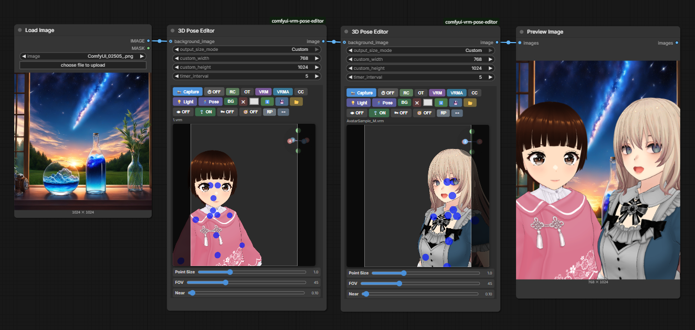
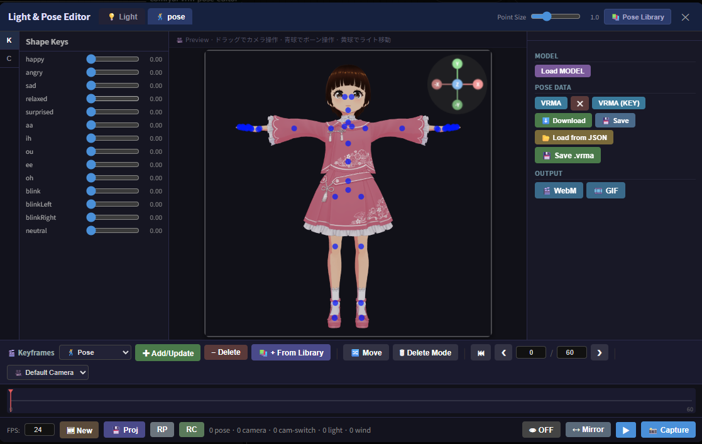
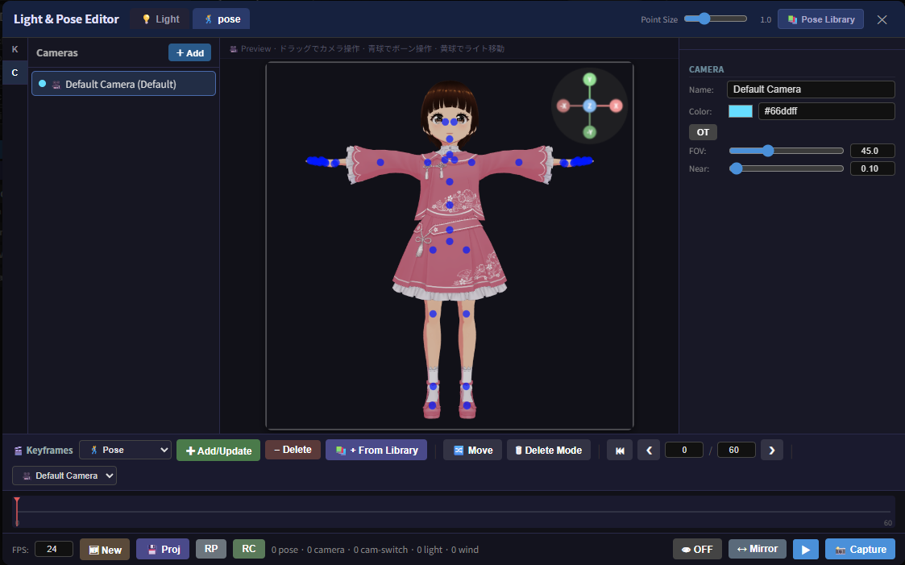
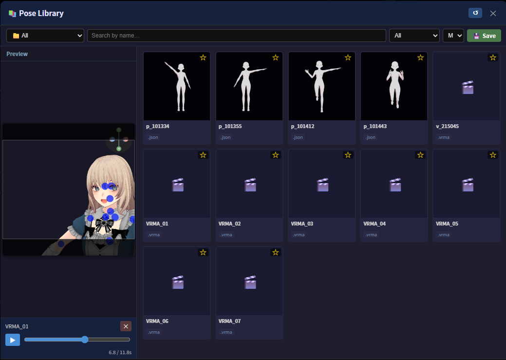
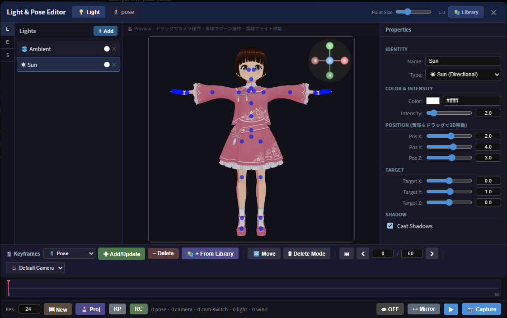
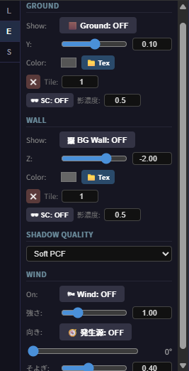
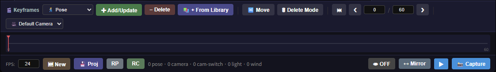

# 3D Pose Editor — ComfyUI Custom Node

An interactive 3D pose editor node for ComfyUI.  
Load VRM / GLB / GLTF models directly in the browser, drag bones to pose them, animate poses/camera/lights on a keyframe timeline, and output the result to your workflow.

ComfyUI 上で動作するインタラクティブな 3D ポーズエディタノードです。  
VRM・GLB・GLTF モデルをブラウザから直接読み込み、ボーンをドラッグ操作してポーズを付け、キーフレームタイムラインでポーズ・カメラ・ライトをアニメーションさせ、そのままワークフローに出力できます。

---

## English

### Features / Buttons

**Row 1** (capture / timer / model)

| Button | Function |
|--------|----------|
| 📸 Capture | Send current pose as PNG to node output |
| ⏱ | Timer capture toggle — auto-captures every `timer_interval` seconds |
| VRM | Load VRM / GLB / GLTF file from local disk |
| VRMA | Load a `.vrma` animation and play it back on the current VRM (see [VRMA Animation Playback](#vrma-animation-playback-vrma) below) |
| VRMA (KEY) | Load a `.vrma` file and sample it into pose keyframes on the Light & Pose Editor's timeline instead of playing it back as a clip (see [Keyframe Timeline](#keyframe-timeline-pose--camera--cam-switch--light--wind) below). Opens the editor on its Pose tab automatically if it isn't already open |
| CC | Color correction ON/OFF (sRGB + ACES Filmic) |

**Row 2** (Light & Pose Editor / background / pose file)

| Button | Function |
|--------|----------|
| 💡 Light | Open the **Light & Pose Editor** on its Light tab (see below) |
| 🕺 Pose | Open the **Light & Pose Editor** on its Pose tab (see below) |
| BG | Load background image from local disk |
| ✕ | Clear background image **and** background color |
| 🎨 | Scene background color picker |
| ⬇️ | Download current pose as JSON file |
| 💾 | Save current pose to `poses/` folder |
| 📂 | Load pose file (.json / .vroidpose) |

**Row 3** (look-at / spring bone / camera / pose)

| Button | Function |
|--------|----------|
| 👁 | Toggle LookAt target — when ON, drag the cyan marker in the 3D view to steer the eyes/head (no effect if the model has no LookAt data) |
| 🎐 | Toggle spring bone physics (hair, skirts, etc.) — turning OFF freezes the current sway state |
| 🌬 | Toggle a breeze wind effect on the spring bones (hair, skirts, etc.) — strength / direction / gustiness are adjusted in the Light & Pose Editor; has no effect while 🎐 is OFF |
| 🧭 | Toggle the wind source marker — when ON, drag the orange cone in the 3D view to set the wind direction (same operation as the LookAt marker); while ON, the "direction" slider in the Light & Pose Editor is disabled |
| RC | Reset camera |
| OT / PR | Toggle Orthographic / Perspective camera |
| RP | Reset pose — also available inside the Light & Pose Editor's keyframe panel |
| ↔ | Mirror pose (flip left ↔ right) |

**Row 4** (file name)

Displays the name of the currently loaded VRM / GLB / GLTF file.

#### LookAt Target (👁)

When enabled, a cyan marker appears in the 3D view and the model's eyes/head automatically track its position. Drag the marker to steer the gaze. Resetting/loading a pose or mirroring re-anchors spring bones so nothing jumps unexpectedly. The marker itself is never captured in the output image.

#### Spring Bone Physics (🎐)

Toggles the sway-bone simulation (hair, skirts, etc.) defined on the VRM. Turning it OFF freezes the sway at its current state instead of resetting to rest pose. On Reset Pose / Load Pose / Mirror, the spring bone internal state is re-anchored to the new pose so it doesn't snap unnaturally right after the switch.

#### Wind Effect (🌬) and Wind Source Marker (🧭)

Adds a gentle breeze to the spring bones (hair, skirts, etc.) on top of the model's own gravity, using a sum of sine waves so the strength and direction gently drift over time instead of blowing in one fixed direction. Since three-vrm has no built-in wind API, this is implemented by overwriting each spring bone joint's `gravityDir`/`gravityPower` every frame with "the model's original gravity vector + the current wind vector" (the vendor `three-vrm` module itself is never modified). Has no effect while 🎐 Spring Bone Physics is OFF (the joint physics loop itself is paused).

- **🌬 Wind**: master ON/OFF toggle. Strength, direction, and gustiness are adjusted with the sliders in the Light & Pose Editor's Light tab → **E** (Environment) sub-tab, "Wind" section.
- **🧭 Wind Source Marker**: when ON, an orange cone marker appears in the 3D view, using the exact same drag mechanism as the 👁 LookAt marker. The wind direction is computed as the direction from the marker toward a fixed reference point near the model, so you can steer the wind (including vertical components) just by dragging the cone. While ON, the "direction" slider in the Light & Pose Editor is disabled since the marker takes over. The marker is never captured in the output image.

### Light & Pose Editor (💡 / 🕺)

A single modal that combines what used to be three separate windows (Light Editor, Pose Library launcher, VRMA Timeline Editor) into one, so switching between lighting work and pose/animation work no longer means jumping between differently-shaped dialogs.

- Click **💡 Light** or **🕺 Pose** on the node to open it directly on the corresponding tab.
- The header holds the **💡 Light / 🕺 pose** tab switcher, a **Point Size** slider (same control as the node's own Point Size slider below the canvas — moving either one updates the bone-handle marker size; the node's slider is re-synced when the modal closes), and a **📚 Library** button whose role depends on the active tab (see below).
- The center pane embeds the **actual WebGL canvas** (not a copy), scaled to fit — bone dragging, camera orbit, and light-helper dragging all work natively inside the modal exactly as on the node.
- A **keyframe timeline panel** is docked at the bottom and shared by both tabs — see [Keyframe Timeline](#keyframe-timeline-pose--camera--cam-switch--light--wind) below.

#### Light tab

The left pane has three sub-tabs:

| Sub-tab | Contents |
|---------|----------|
| **L** — Lights | The light list (add/remove/rename lights) and, on the right, a **Properties** panel for the selected light: type (☀ Sun / 💡 Point / 🔦 Spot / ▭ Box RectArea / 🌐 Ambient), color, intensity, position XYZ, target XYZ (Directional/Spot), angle & penumbra (Spot), distance & decay (Point/Spot), shadow (Directional only) |
| **E** — Environment | Ground plane, background wall, shadow quality, and the **🌬 Wind** controls described above |
| **S** — Settings | 🖱 Ctrl+Right-drag zoom toggle (see [Camera Controls](#camera-controls)) and 🖼 anti-aliasing enhancement (supersampling) toggle |

On the **L** sub-tab, **📚 Library** toggles a light-preset library panel — see [Light Library](#light-library-) below. Drag the yellow sphere in the preview to reposition a light in 3D.

#### Pose tab

The left pane has two sub-tabs:

| Sub-tab | Contents |
|---------|----------|
| **K** — Shape Keys | Sliders (0.0 – 1.0) for every morph/expression on the model, updated in real time. This replaces the old collapsible "Shape Keys" panel that used to live at the bottom of the node. |
| **C** — Camera | The camera list (add / select / delete / rename / recolor) — see [Camera Management](#camera-management-) below |

The right pane (kept at the same width as the Light tab's Properties panel so the dialog doesn't change size when you flip between tabs or sub-tabs; no "Properties" heading is shown, unlike the Light tab) shows different content depending on which left sub-tab is active:

- **K sub-tab**:
  - **Model** — **Load MODEL**, a duplicate of the node's own model loader.
  - **Pose Data** — **VRMA**, **✕** (unload the currently loaded VRMA), **VRMA (KEY)** (load a `.vrma` as pose keyframes instead of a clip), **⬇️ Download**, **💾 Save**, **📂 Load from JSON**, and **💾 Save .vrma** (moved here from the keyframe panel below, since that panel was getting crowded — see [Keyframe Timeline](#keyframe-timeline-pose--camera--cam-switch--light--wind)).
  - **Output** — **🎬 WebM** and **🎞️ GIF**, also moved here from the keyframe panel for the same reason.
- **C sub-tab**: **Camera** properties for whichever camera is selected in the list — Name, Color, an OT/PR toggle, and **FOV**/**Near** sliders. These read/write the shared `editor` state for the currently *active* camera (same as the node's own OT/RC/FOV/Near controls), so either side stays in sync once the modal is closed or you switch tabs/cameras. (The Look at Target toggle used to live here too — it's been moved to the keyframe panel below, since it's a model-wide setting rather than a per-camera one.)

VRM/VRMA loading and unloading are routed through the same `nodeActions` bridge the node uses internally, so the node's own buttons/labels stay in sync too.

**📚 Library** opens the [Pose Library](#pose-library-) instead of a preset panel.

#### Camera Management

The **C** sub-tab manages multiple cameras, the same way the Light tab's **L** sub-tab manages multiple lights — but with one key difference: only *one* camera (or the **🖥 Monitor** free-view, see below) is ever "live" at a time.

- The scene starts with one camera (named **Camera 1**) plus any number of extra cameras added with **+ Add** (named **Camera 2**, **Camera 3**, ... in the order they were created — the number never gets reused, even if you delete an earlier camera and add a new one). Every camera is equal — none of them is special or protected, and any camera (including Camera 1) can be deleted with its **✕** button. Deleting the last remaining camera drops you into **🖥 Monitor** mode automatically (see below).
- Clicking a camera in the list makes it the **active** camera immediately: the preview jumps to that camera's saved viewpoint, and from then on normal mouse-drag camera controls (orbit / pan / zoom / Alt+Right-drag roll — see [Camera Controls](#camera-controls)) move *that* camera. Switching away and back preserves its position, orientation, FOV, near-clip, and Orthographic/Perspective state exactly as you left them.
- Cameras you aren't currently controlling are drawn in the 3D view as small camera-shaped helper icons, scaled so they read as roughly the same size on screen regardless of distance. You can also **drag** any of these helpers to reposition that camera directly in 3D — it doesn't need to be the active camera; this is the easiest way to place a camera and immediately record a **Camera track** keyframe for it (see below) without switching your own view away from what you're currently framing.
- Each camera has a **color** (auto-assigned from a fixed palette when added, changeable from the **Color** field in its Properties) — this is the color its keyframes are drawn in on the timeline's **🎬 Cam Switch** track, so you can tell at a glance which cut belongs to which camera (see [Keyframe Timeline](#keyframe-timeline-pose--camera--cam-switch--light--wind) below).

#### Monitor (🖥)

The **🖥 Monitor** toggle sits at the right end of the Keyframe Timeline toolbar (below). Turning it **ON** detaches the preview from every managed camera: you get a free-roaming third-person viewpoint that ignores the timeline's **Cam Switch** and per-camera **Camera** tracks entirely — scrubbing or playing back the timeline no longer moves the view out from under you. Every camera in the scene is drawn as a draggable helper icon while Monitor is on (regardless of which sub-tab you're on), so it's the natural place to lay out a whole camera rig by eye before recording any keyframes. The Monitor itself has no track and can't hold keyframes — it's purely a scouting viewpoint; add a camera if you want something you can key.

Turning Monitor **OFF** hands control back to a real camera: if the current frame has a **Cam Switch** keyframe, its camera becomes active (matching what playback would show at that frame); otherwise it falls back to whichever camera was active right before you turned Monitor on, or the first camera in the list if that one's gone.

### Keyframe Timeline (Pose · Camera · Cam Switch · Light · Wind)

Docked at the bottom of the Light & Pose Editor (visible on both tabs), this panel lets you build a short animation by placing keyframes on a frame-based timeline, then preview it, save it, or render it out as `.vrma` / WebM / GIF.

The track dropdown next to the "🎬 Keyframes" title holds **🕺 Pose**, one **Camera** track *per camera currently in the scene* (labelled with that camera's own icon and name, e.g. "🎥 Camera 1" / "📷 Camera 2" — the list grows/shrinks live as you add, delete, or rename cameras in the [C sub-tab](#camera-management-)), **🎬 Cam Switch**, **💡 Light**, and **🌬 Wind**. Only the selected track's keyframes are drawn on the timeline (pose = yellow, light = orange, wind = cyan, each per-camera Camera track = that camera's own color; Cam Switch markers are drawn in *each keyframe's own camera's color* too — see [Camera Management](#camera-management-)), and the **✚ Add/Update** / **− Delete** buttons always act on whichever track is selected (their color changes to match; the label itself no longer spells out the track name, since the dropdown already shows which one is selected). Dragging a marker (🔀 Move) onto a frame that already has a keyframe on a *different* track merges the two instead of overwriting the hidden track's data.

**🗑 Delete Mode** is a second way to remove keyframes: turn it on, then click a marker on the selected track to delete it, or drag across several markers to erase them one after another like an eraser. It's mutually exclusive with 🔀 Move — turning one on switches the other off.

| Control | Function |
|---------|----------|
| Track dropdown | Switches which track the Add/Delete buttons, the visible timeline markers, and 🔀 Move / 🗑 Delete Mode operate on: 🕺 Pose / one 📷 Camera track per camera / 🎬 Cam Switch / 💡 Light / 🌬 Wind |
| ✚ Add/Update | Add a keyframe on the selected track at the current frame from whatever is currently set (or overwrite the one already there) |
| − Delete | Delete the selected track's keyframe at the current frame |
| 📚 + From Library | Pose track only. Pick a saved pose from the Pose Library and add it as a pose keyframe at the current frame |
| 🔀 Move | While ON, drag a marker on the timeline to move it to a different frame (if that frame already has a keyframe on the same track, the drag stops there instead of overwriting it) |
| 🗑 Delete Mode | While ON, click or drag across markers on the selected track to erase them like an eraser; mutually exclusive with 🔀 Move |
| ⏮ ❮ *frame* / *total* ❯ | Jump to frame 0 / step back one frame / current frame and total length / step forward one frame |
| Active-camera label | Read-only — shows the icon and name of whichever camera is currently active, or "🖥 Monitor" while the free view is on. Selecting a camera is done from the [C sub-tab](#camera-management-) list; this label just reflects it |
| 🖥 Monitor | Toggles the free third-person view described in [Camera Management](#camera-management-) above — ON detaches the preview from the timeline's camera tracks, OFF hands control back to a real camera |
| FPS | Playback frame rate used for preview, `.vrma` time conversion (`time = frame / fps`), and VRMA-to-keyframes sampling (see below) |
| 🆕 New | Clear the entire timeline (all tracks) and start over |
| 💾 Proj | Save/load the whole timeline as a named project on the server (`.kf_projects/`) |
| RP / RC | Reset pose / reset camera — same as the node's own RP/RC buttons |
| *pose · camera · cam-switch · light · wind* status | Keyframe count on each of the five tracks |
| 👁 LookAt | Toggle the LookAt Target marker ON/OFF — moved here from the Pose tab's Properties panel, since it's a model-wide setting rather than a per-camera one |
| ↔ Mirror | Mirror the current pose left ↔ right — same as the node's own ↔ button |
| ▶ / ⏸ | Play/pause the timeline. Plays from the current frame through the last frame and loops back to 0, regardless of whether any pose keyframes exist |
| 📸 Capture | Same as the node's own 📸 Capture button — sends the current frame to the node's output |

> **💾 Save .vrma**, **🎬 WebM**, and **🎞️ GIF** used to live in this panel too — they've moved to the Pose tab's **K** sub-tab Properties (Pose Data / Output sections) to keep this toolbar from getting overcrowded. See [Pose tab](#pose-tab) above.

#### Pose track — LookAt Target and Shape Keys

The LookAt Target's ON/OFF state and marker position, and the Shape Keys sliders' current values, are bundled onto pose keyframes automatically whenever you add/update one — they're treated as part of the character's pose rather than separate tracks. Both are interpolated during preview/playback, but — like camera/light/wind keyframes — they are **preview-only**; only bone rotations are written into the exported `.vrma` (the glTF-based `.vrma` format has no camera/light/wind/LookAt/shape-key animation, and that export was intentionally left out of scope for now). If you need any of that baked into a shareable file, use **🎬 WebM** or **🎞️ GIF** instead, which render exactly what you see.

#### Camera track

Every camera gets its **own** independent Camera track, storing `{position, target, up, fov}` linearly interpolated between that camera's own surrounding keyframes (`up` is normalized after interpolation so camera roll blends smoothly). A camera doesn't need to be active to record or play back its track — **✚ Add/Update** captures whatever that camera's current position is (drag its helper icon into place first, or switch to it and move the view — either works), and during playback each camera's track drives that camera regardless of which one is currently on screen. Pair it with a **Cam Switch** keyframe if you want the timeline to actually cut to that camera at some point. While **🖥 Monitor** is on, Camera tracks keep recording/deleting normally but stop being *applied* to the live view — see [🖥 Monitor](#monitor-) above.

#### Cam Switch track

Records which camera is active as a **cut** rather than a blend — a discrete switch with no position interpolation, the same way LookAt's ON/OFF flips at the end of an interval instead of fading. Add a keyframe here and the moment playback reaches that frame, the preview jumps straight to that camera's current viewpoint. Each marker is drawn in its own camera's color (see [Camera Management](#camera-management-)) so a glance at the timeline shows which cut belongs to which camera. Switching cameras by hand (independent of recording a keyframe) is done from the [C sub-tab](#camera-management-) camera list. A Cam Switch keyframe can only target a real camera — the **🖥 Monitor** free view has no track and is skipped entirely by playback (see [🖥 Monitor](#monitor-) above).

#### Light track

Stores a full snapshot of every managed light (type, color, intensity, position, target, angle/penumbra, distance/decay, shadow — the same fields editable in the Light tab's **L** Properties panel). Interpolation matches lights between the surrounding keyframes by ID: numeric fields and positions are linearly interpolated, everything else (color, type, on/off) switches over at the end of the interval. If a light was added or removed between two Light keyframes, it isn't interpolated across that gap — it just holds its last known state.

#### Wind track

Stores the same Wind settings as the **E** (Environment) sub-tab's "Wind" section — enabled, strength, direction, gustiness, wind-source-marker enabled, and marker position. Interpolated the same way as the Light track (numeric/position fields blend, on/off switches at the interval's end).

#### Importing a `.vrma` as pose keyframes

Instead of playing a `.vrma` back as a single clip (see [VRMA Animation Playback](#vrma-animation-playback-vrma) below), you can sample it directly onto the **Pose** track:

- **🔑 Load KEY** in the [Pose Library](#pose-library-)'s mini player, or **VRMA (KEY)** on the node / in the Pose tab's Properties panel.
- The clip is sampled once per frame at the timeline's current **FPS** (`frame = 0 … round(duration × fps)`), each frame captured as a full pose keyframe — nothing is thinned out. `totalFrames` is extended automatically if the clip is longer than the current timeline.
- If the Pose track already has keyframes, a confirmation dialog appears first (camera/light/wind keyframes are never touched by this).
- **VRMA (KEY)** works even if the Light & Pose Editor isn't open yet — it opens on the Pose tab automatically and imports right after.

WebM export uses `MediaRecorder` + `canvas.captureStream()`; GIF export uses a small self-contained encoder (`js/gif_encoder.js`, NeuQuant color quantization + LZW, no external dependencies) and encodes one frame at a time so the browser tab stays responsive even on longer timelines — a GIF with many frames will still take a while to encode (color quantization is the slow part), the button label shows `Encode n/total` progress while it works.

### VRMA Animation Playback (VRMA)

Load a `.vrma` (VRM Animation) file — a single pre-made clip, as opposed to the multi-track timeline above — and play it back on the currently loaded VRM, then pause on any frame to use it as a regular still pose — 📸 Capture / 💾 Save / ⬇️ Download all work exactly as before on the paused frame, and bones can even be nudged further with the normal drag controls.

> Want the clip as editable, per-frame keyframes instead of a single clip? Use **VRMA (KEY)** instead of **VRMA** — see [Importing a `.vrma` as pose keyframes](#importing-a-vrma-as-pose-keyframes) above.

**Requires a VRM model with humanoid bones already loaded** — plain GLB/GLTF models are not supported, since retargeting relies on the VRM humanoid rig.

Usage:

1. Load a VRM, then click **VRMA** (or drop a `.vrma` file onto the canvas) to load an animation clip.
2. **▶ / ⏸** toggles playback. Drag the seek bar to scrub to any frame — dragging automatically pauses playback.
3. While paused, use 📸 / 💾 / ⬇️ as usual to capture or save that frame as a still pose.
4. **✕** unloads the animation and hides the timeline panel. The same button is also available next to **VRMA** in the Pose tab's Properties panel.

Notes:

- Loading a new VRM/GLB/GLTF model clears the currently loaded VRMA.
- While a VRMA is loaded, the 👁 LookAt marker is temporarily disabled (its target is cleared) to avoid fighting with the animation's own look-at track, if any. It's restored automatically once the VRMA is unloaded.

#### Timer Capture (⏱)

Click **⏱** to start / stop the timer.

| State | Color | Behavior |
|-------|-------|----------|
| OFF | Grey (`#555`) | No auto-capture |
| ON — waiting | Dark red (`#7b0000`) | Auto-captures every N seconds |
| ON — firing | Bright red (`#e74c3c`) | Flashes for 300 ms on each capture |

The interval is read from the **`timer_interval`** node parameter (1 – 3600 s, default 5 s).  
While the timer is running, the **📸 Capture** button does **not** flash — only the ⏱ button changes colour.

### Installation

#### Option A: ComfyUI Manager (Recommended)

1. Open ComfyUI Manager and click **"Install Custom Nodes"**.
2. Search for `comfyui-vrm-pose-editor`.
3. Click **Install** and restart ComfyUI.

#### Option B: Manual

1. Place the `3dpose_custom_cm` folder inside `ComfyUI/custom_nodes/`.
2. Restart ComfyUI.
3. Add the **"3D Pose Editor"** node (category: `3D Pose`) from the node menu.

### Camera Controls

| Action | Result |
|--------|--------|
| Left drag | Rotate camera |
| Ctrl + Left drag | Pan |
| Right drag | Pan |
| Scroll wheel | Zoom (default) |
| Ctrl + Right drag | Zoom — only when the "Ctrl+Right drag zoom" switch is ON in the Light & Pose Editor (see below) |
| Alt + Right drag | Roll the camera (rotate `camera.up` around the view axis) |
| Alt + Left drag | Zoom (Node 2.0 mode) |
| Click gizmo X/Y/Z axis | Snap to that view direction |

> On some PCs the scroll wheel does not zoom (mouse/driver dependent). Open the **Light & Pose Editor (💡)**, go to the Light tab's **S** sub-tab, and toggle **🖱 Ctrl+Right drag zoom** to switch from wheel zoom to Ctrl+Right-drag zoom.

### Camera Parameters (FOV / Near / Point Size)

Three sliders below the preview adjust the Perspective camera and bone-handle size in real time (the Point Size slider is duplicated in the Light & Pose Editor's header for convenience while the modal is open):

| Slider | Range | Default | Effect |
|--------|-------|---------|--------|
| Point Size | 0.2 – 3.0 | 1.0 | Bone-handle control-point sphere size multiplier |
| FOV | 10° – 120° | 45° | Field of view. While in Orthographic mode, the ortho frustum size is recomputed to match (`distance × tan(fov/2)`) so the two modes stay visually consistent |
| Near | 0.01 – 5 | 0.1 | Near clipping plane, applied to both Perspective and Orthographic cameras. Raise it only if you need to fix z-fighting; too high a value clips away geometry close to the camera |

### Bone Controls

Drag the blue control points on each bone joint.

| Action | Rotation |
|--------|----------|
| Left / Right drag | Y-axis |
| Up / Down drag | X-axis |
| Alt + Up / Down drag | Z-axis |

### Loading Models

Click the **VRM** button to select a local `.vrm` / `.glb` / `.gltf` file.  
The model is automatically scaled and centred.

- **VRM**: bones detected via `@pixiv/three-vrm` HumanBone.
- **GLB / GLTF**: works with any skeleton-based model.

### Default Model

Place one of the following files in the `js/` folder to auto-load on startup:

| Filename | Format |
|----------|--------|
| `model.glb` | GLB |
| `model.vrm` | VRM |
| `model.gltf` | GLTF |

Priority: `model.glb` → `model.vrm` → `model.gltf`. If none exist, the editor starts without a model.

### Pose Library (📚)

Open it via **🕺 Pose → 📚 Library** on the node (or the same button from inside the Light & Pose Editor's Pose tab).

- Pose files (`.json` / `.vroidpose`) **and** `.vrma` animations stored in the `poses/` folder are displayed as thumbnails side by side.
- A **1-column-wide preview pane** on the left embeds the live 3D canvas (the same DOM-move technique the Light & Pose Editor itself uses), so applying a still pose or playing back a `.vrma` is actually visible while the library is open — it no longer plays "behind" the dialog.
- **Subdirectory filtering**: create subfolders inside `poses/` to organise poses by category; select a folder from the dropdown to filter.
- **Click** a `.json`/`.vroidpose` thumbnail to apply the pose immediately (shown in the preview pane). **Click** a `.vrma` thumbnail to load it into the mini player below the preview (name, ✕ eject, ▶/⏸, seek bar, time) — the animation plays right there in the preview, but clicking a card only previews it; it does **not** yet affect the node or the Light & Pose Editor's own timeline.
  - **⬇ Load** (below the mini player) commits the previewed `.vrma` to the node as-is (a regular clip, same as the node's own **VRMA** button) and closes the Pose Library.
  - **🔑 Load KEY** samples the previewed `.vrma` into pose keyframes on the Light & Pose Editor's timeline instead (see [Importing a `.vrma` as pose keyframes](#importing-a-vrma-as-pose-keyframes)) and closes the Pose Library.
- **Right-click** for more options (still poses only):
  - ↔️ Mirror & Apply
  - ⭐ Add / Remove Favorites
  - 📝 Edit Memo
  - ✏️ Rename File
  - 🖼 Regenerate Thumbnail (Front / Back)
- **💾 Save**: saves the current editor pose to the `poses/` folder as `p_HHMMSS.json`.
- Thumbnails are auto-generated using the loaded VRM model and cached server-side (`.vrma` entries use a fixed 🎬 placeholder instead, since animations aren't thumbnailed).

### Pose Save / Load

| Button | Action |
|--------|--------|
| ⬇️ | Download pose as `pose.json` (browser download) |
| 💾 | Save pose to `poses/p_HHMMSS.json` on the server |
| 📂 | Load pose file (or drop onto canvas) |

Supported formats:

| Format | Description |
|--------|-------------|
| `.json` (own format) | Saved by ⬇️ or 💾 |
| `.vroidpose` | VRoid Studio pose file (body / arms / legs; finger presets not supported) |

#### VRM0 / VRM1 Compatibility

Pose JSON is saved in **version 2** format (quaternion + `vrmVersion` tag).  
Cross-version conversion (VRM0 ↔ VRM1) is applied automatically on load.  
Legacy version 1 (Euler angles) files are still supported.

### Mirror Pose (↔)

Click **↔** on the node (or right-click → **↔️ Mirror & Apply** in the Pose Library) to flip the current pose left ↔ right.  
Left/Right bone pairs are swapped and quaternions are YZ-flipped `(qx, -qy, -qz, qw)`.

#### Light Library (📚)

On the Light & Pose Editor's Light tab → **L** sub-tab, click **📚 Library** to open the light-preset library panel.

| Action | Description |
|--------|-------------|
| 💾 Save Current | Save all current settings as a named preset |
| Click a preset card | Apply saved settings immediately |
| Right-click a card | Rename or delete the preset |
| Search field | Filter presets by name |
| ↺ Reload | Refresh the preset list from the server |

Presets are stored server-side in `.light_library/` inside the node folder.  
They persist across browser restarts and are available on any machine sharing the same ComfyUI server.

> **Note**: Texture images are not saved in presets (binary data is excluded).  
> All numeric settings (color, intensity, positions, Ground/Wall/Shadow values) are saved and restored.

#### Ground & Background Wall

Found on the Light & Pose Editor's Light tab → **E** (Environment) sub-tab.

| Control | Function |
|---------|----------|
| 🟫 Ground ON/OFF | Toggle ground plane (receives shadows) |
| Y slider | Ground height |
| 🖼 BG Wall ON/OFF | Toggle background wall (receives shadows) |
| Z slider | Wall depth |
| 🎨 Color picker | Surface color |
| 📁 Tex | Load image texture (tiled) |
| Tile | Texture repeat count |
| 🕶 SC | Shadow Catcher — surface becomes transparent, shows shadows only |
| 影濃度 / Opacity | Shadow darkness (0.01 – 1.0) |

### Aspect Ratio Frame

When `output_size_mode` is **Custom**, a letterbox overlay is drawn in real time to show the output crop area.  
**Capture** outputs only the framed region — no stretching.

### Color Correction (CC)

Toggle sRGB color space + ACES Filmic tone mapping.  
Enable if VRoid Studio / Blender models appear too dark.

---

## 日本語

### 機能・ボタン一覧

**1行目**（キャプチャ・タイマー・モデル）

| ボタン | 機能 |
|--------|------|
| 📸 Capture | 現在のポーズを PNG としてノード出力に送信 |
| ⏱ | タイマーキャプチャのトグル（`timer_interval` 秒ごとに自動キャプチャ） |
| VRM | VRM / GLB / GLTF ファイルをローカルから読み込む |
| VRMA | `.vrma` アニメーションを読み込み、現在の VRM 上で再生（後述の[VRMAアニメーション再生](#vrmaアニメーション再生vrma)を参照） |
| VRMA (KEY) | `.vrma` ファイルを読み込み、再生クリップとしてではなくLight & Pose Editorのタイムラインへポーズキーフレーム列としてサンプリング読み込みする（後述の[キーフレームタイムライン](#キーフレームタイムラインポーズカメラカメラ切替ライトwind)を参照）。モーダルが未オープンなら自動的にPoseタブで開く |
| CC | カラー補正 ON/OFF（sRGB + ACES Filmic） |

**2行目**（Light & Pose Editor・背景・ポーズファイル）

| ボタン | 機能 |
|--------|------|
| 💡 Light | **Light & Pose Editor** をLightタブで開く（後述） |
| 🕺 Pose | **Light & Pose Editor** をPoseタブで開く（後述） |
| BG | 背景画像をローカルから読み込む |
| ✕ | 背景画像**および**背景色をクリア |
| 🎨 | シーン背景色ピッカー |
| ⬇️ | 現在のポーズを JSON ファイルとしてダウンロード |
| 💾 | 現在のポーズを `poses/` フォルダに保存 |
| 📂 | ポーズファイルを読み込む（.json / .vroidpose） |

**3行目**（視線・揺れ・カメラ・ポーズ）

| ボタン | 機能 |
|--------|------|
| 👁 | 視線ターゲットの ON/OFF。ON にすると 3D ビュー内のシアン色マーカーをドラッグして目・頭の向きを誘導できる（モデルに LookAt 情報が無い場合は効果なし） |
| 🎐 | 揺れ物理（髪・スカート等）の ON/OFF。OFF にすると現在の揺れ具合のまま固定される |
| 🌬 | 揺れボーン（髪・スカート等）にそよ風エフェクトを加える ON/OFF。強さ・向き・そよぎはLight & Pose Editorで調整。🎐 が OFF の間は効果なし |
| 🧭 | 風の発生源マーカーの ON/OFF。ON にすると 3D ビュー内のオレンジ色のコーンをドラッグして風向きを指定できる（視線マーカーと同じ操作方法）。ON の間、Light & Pose Editorの「向き」スライダーは無効化される |
| RC | カメラをリセット |
| OT / PR | Orthographic / Perspective カメラを切り替え |
| RP | ポーズをリセット — Light & Pose Editorのキーフレームパネルにも同機能あり |
| ↔ | ポーズを左右反転 |

**4行目**（ファイル名）

現在読み込まれている VRM / GLB / GLTF のファイル名を表示。

#### 視線ターゲット（👁）

ON にすると 3D ビュー内にシアン色のマーカーが表示され、モデルの目・頭がマーカーの方向を自動的に追従します。マーカーをドラッグして視線の向きを調整できます。ポーズリセット・ポーズ読込・ミラー実行時は揺れボーンの内部状態を新しいポーズに合わせて再アンカーするため、切替直後に不自然に跳ねることはありません。マーカー自体は出力画像には写り込みません。

#### 揺れ物理（🎐）

VRM に定義された揺れボーン（髪・スカート等）の物理シミュレーションの ON/OFF を切り替えます。OFF にすると、リセット姿勢に戻るのではなく現在の揺れ具合のまま固定されます。ポーズリセット・ポーズ読込・ミラー実行の直後は揺れボーンの内部状態を新しいポーズに再アンカーするため、切替直後に不自然に跳ねることはありません。

#### 風エフェクト（🌬）と発生源マーカー（🧭）

揺れボーン（髪・スカート等）に、モデル本来の重力に加えてそよ風を吹かせる機能です。複数のsin波を合成することで、風の強さ・向きが一定方向に吹き続けるのではなく時間とともに緩やかに揺らぐようにしています。three-vrmには風専用のAPIが存在しないため、各揺れボーンの`gravityDir`/`gravityPower`を毎フレーム「モデル本来の重力ベクトル＋現在の風ベクトル」で上書きすることで実現しています（vendorの`three-vrm`本体は無改造）。🎐揺れ物理がOFFの間はジョイント物理演算自体が停止するため、風の効果もありません。

- **🌬 風**: 全体のON/OFFトグル。強さ・向き・そよぎは、Light & Pose EditorのLightタブ →「E」（Environment）サブタブ内「Wind」セクションのスライダーで調整します。
- **🧭 発生源マーカー**: ONにすると3Dビュー内にオレンジ色のコーンマーカーが表示されます。操作方法は👁視線マーカーと全く同じドラッグ方式です。風向きは「マーカー位置からモデル付近の固定基準点への方向」として計算されるため、コーンをドラッグするだけで（上下方向を含む）風向きを自由に指定できます。ONの間はマーカーが向きを決定するため、Light & Pose Editorの「向き」スライダーは無効化されます。マーカー自体は出力画像には写り込みません。

### Light & Pose Editor（💡 / 🕺）

以前は別々のウィンドウだったLightエディタ・ポーズライブラリの起動口・VRMAタイムラインエディタを1つのモーダルへ統合したものです。ライティング作業とポーズ・アニメーション作業を行き来するたびに形の違うダイアログへ切り替わる、という煩わしさを解消しています。

- ノードの **💡 Light** または **🕺 Pose** をクリックすると、対応するタブが直接開いた状態でモーダルが表示されます。
- ヘッダーには **💡 Light / 🕺 pose** タブ切り替え、**Point Size** スライダー（ノード自身のPoint Sizeスライダーと同じ機能。どちらを動かしてもボーンハンドルの球サイズが変わり、モーダルを閉じるとノード側の表示値も再同期されます）、そしてタブに応じて役割が変わる **📚 Library** ボタンがあります（後述）。
- 中央ペインには**実際のWebGLキャンバス**（コピーではない）が枠に合わせて埋め込まれ、ボーンドラッグ・カメラ操作・ライトヘルパードラッグがすべてノード上と全く同じようにモーダル内でネイティブに動作します。
- 下部には両タブ共通の**キーフレームタイムラインパネル**が常設されています（後述の[キーフレームタイムライン](#キーフレームタイムラインポーズカメラカメラ切替ライトwind)を参照）。

#### Lightタブ

左ペインは3つのサブタブに分かれています。

| サブタブ | 内容 |
|---------|------|
| **L** — Lights | ライト一覧（追加・削除・名前変更）と、右側の選択中ライトの**Properties**パネル: タイプ（☀ Sun / 💡 Point / 🔦 Spot / ▭ Box RectArea / 🌐 Ambient）、色、強度、位置XYZ、ターゲットXYZ（Directional/Spot）、角度＆ペナンブラ（Spot）、距離＆減衰（Point/Spot）、シャドウ（Directionalのみ） |
| **E** — Environment | 地面・背景壁・シャドウ品質、および上述の**🌬 Wind**コントロール |
| **S** — Settings | 🖱 Ctrl+右ドラッグでズームのトグル（[カメラ操作](#カメラ操作)参照）と、🖼 アンチエイリアス強化（スーパーサンプリング）のトグル |

**L**サブタブでは、**📚 Library**でライトプリセットライブラリパネルをトグルできます（後述の[ライトライブラリ](#ライトライブラリ📚)を参照）。プレビュー内の黄色球体をドラッグしてライトを3D移動できます。

#### Poseタブ

左ペインは2つのサブタブに分かれています。

| サブタブ | 内容 |
|---------|------|
| **K** — Shape Keys | モデルが持つすべてのモーフ・表情のスライダー（0.0〜1.0）をリアルタイムに調整。従来ノード下部にあった折りたたみ式Shape Keysパネルはこちらに置き換わりました。 |
| **C** — Camera | カメラ一覧（追加・選択・削除・名前変更・色変更）— 詳細は後述の[カメラ管理](#カメラ管理)を参照 |

右ペイン（Lightタブ側のPropertiesパネルと同じ幅にすることで、Light/Poseタブやサブタブを切り替えてもダイアログ全体のサイズが変わらないようにしています。Lightタブと異なり「Properties」という見出しは表示しません）は、選択中の左サブタブに応じて内容が変わります:

- **Kサブタブ**:
  - **Model** — **Load MODEL**（ノード側のモデルロード機能の複製）
  - **Pose Data** — **VRMA**、**✕**（読み込み中のVRMAをアンロード）、**VRMA (KEY)**（`.vrma`をクリップではなくポーズキーフレームとして読み込む）、**⬇️ Download**、**💾 Save**、**📂 Load from JSON**、**💾 Save .vrma**（下部のキーフレームパネルが手狭になったためこちらへ移設 — 詳細は[キーフレームタイムライン](#キーフレームタイムラインポーズカメラカメラ切替ライトwind)を参照）
  - **Output** — **🎬 WebM**・**🎞️ GIF**（こちらも同様の理由でキーフレームパネルから移設）
- **Cサブタブ**: リストで選択中のカメラの**Camera**プロパティ — Name、Color、OT/PR切替、**FOV**/**Near**スライダー。共有の`editor`状態のうち現在**アクティブ**なカメラの状態を直接読み書きするため（ノード自身のOT/RC/FOV/Nearコントロールと同じ）、モーダルを閉じた際やタブ・カメラの切替時にどちら側も再同期されます。（以前ここにあった**Look at Target**トグルは、カメラごとではなくモデル全体の設定であるため、下部のキーフレームパネルへ移設しました。）

VRM/VRMAの読み込み・アンロードはノード内部と同じ`nodeActions`ブリッジ経由で処理されるため、ノード側のボタン表示も連動して更新されます。

**📚 Library**は光源プリセットパネルではなく、[ポーズライブラリ](#ポーズライブラリ📚)を開きます。

#### カメラ管理

**C**サブタブは、Lightタブの**L**サブタブがライトを複数管理するのと同じ要領でカメラを複数管理します。ただし、常に**1台のカメラ、または後述の🖥 Monitor自由視点のどちらか**だけが「操作対象」になる点が異なります。

- シーンには最初から1台のカメラ（**Camera 1**）が存在し、**+ Add**で好きなだけ追加できます（**Camera 2**、**Camera 3**...と作成順に命名され、途中のカメラを削除しても番号が使い回されることはありません）。すべてのカメラは対等で、特別扱いされ削除できないカメラはありません — Camera 1を含むどのカメラも**✕**ボタンで削除できます。最後の1台を削除すると自動的に**🖥 Monitor**モードへ切り替わります（後述）。
- リストでカメラをクリックすると、そのカメラが即座に**アクティブ**になります: プレビューがそのカメラの保存済み視点へ切り替わり、以降は通常のマウスドラッグ操作（回転／パン／ズーム／Alt+右ドラッグでロール — [カメラ操作](#カメラ操作)参照）がそのカメラを動かすようになります。他のカメラへ切り替えて戻ってきても、位置・向き・FOV・ニアクリップ・Ortho/Perspective状態はそのまま保持されています。
- 現在操作していないカメラは、3Dビュー内に小さなカメラ形状のヘルパーアイコンとして表示されます（距離に応じて画面上でほぼ一定のサイズに見えるようスケール調整されます）。このヘルパーは**ドラッグして直接位置を動かす**こともできます — アクティブにする必要はありません。狙った位置にカメラを置いて、そのまま**Cameraトラック**のキーフレームとして記録する（後述）のに使えます。
- 各カメラは**色**を持ちます（追加時に固定パレットから自動割り当て、Propertiesの**Color**欄で変更可能）。この色は、タイムラインの**🎬 Cam Switch**トラック上でそのカメラのキーフレームを描画する色になり、どのカットがどのカメラのものか一目で分かるようになります（詳細は後述の[キーフレームタイムライン](#キーフレームタイムラインポーズカメラカメラ切替ライトwind)を参照）。

#### Monitor（🖥）

**🖥 Monitor**トグルは、後述のキーフレームタイムラインのツールバー右端にあります。ONにするとプレビューがどの管理カメラからも切り離され、タイムラインの**Cam Switch**トラック・カメラごとの**Camera**トラックの影響を一切受けない、自由に動き回れる第三者視点になります — タイムラインをスクラブ/再生しても視点が勝手に動きません。Monitor中はどのサブタブを開いていても全カメラがドラッグ可能なヘルパーアイコンとして表示されるため、キーフレームを打つ前にカメラ配置全体を俯瞰しながら組み立てるのに向いています。Monitor自体にはトラックが無くキーフレームを記録できません — あくまで見て回るための視点で、記録したい場合はカメラを追加してください。

Monitorを**OFF**にすると、実際のカメラへ操作を戻します: 現在フレームに**Cam Switch**のキーフレームがあればそのカメラへ（再生時と同じ挙動）、無ければMonitorをONにする直前にアクティブだったカメラへ、それも既に削除されていればリスト先頭のカメラへフォールバックします。

### キーフレームタイムライン（ポーズ・カメラ・カメラ切替・ライト・Wind）

Light & Pose Editor下部（両タブ共通）に常設されたパネルで、フレームベースのタイムライン上にキーフレームを配置して短いアニメーションを作成し、プレビュー・保存・`.vrma`/WebM/GIFとして書き出せます。

「🎬 Keyframes」見出し横のドロップダウンには、**🕺 Pose**、**シーン内のカメラの数だけ動的に増減するCameraトラック**（そのカメラ自身のアイコン・名前でラベル表示、例:「🎥 Camera 1」「📷 Camera 2」— [Cサブタブ](#カメラ管理)でカメラを追加/削除/リネームするたびにこのリストも連動します）、**🎬 Cam Switch**、**💡 Light**、**🌬 Wind**が並びます。タイムラインには選択中トラックのキーフレームだけが表示され（ポーズ＝黄、ライト＝橙、Wind＝水色、カメラごとのCameraトラックは**そのカメラ自身の色**、Cam Switchのマーカーも**そのキーフレームが指すカメラ自身の色**で描画されます — [カメラ管理](#カメラ管理)参照）、**✚ Add/Update**／**− Delete**ボタンは常に選択中トラックに対して動作します（色は連動して切り替わりますが、ドロップダウン側で既にどのトラックか分かるため、ラベル自体にはトラック名を含めていません）。マーカーを別フレームへドラッグ移動（🔀 Move）した際、移動先に**別トラック**のキーフレームが既にある場合は上書きせずマージされます。

**🗑 Delete Mode**は、キーフレームを削除するもう一つの方法です。ONにした状態で選択中トラックのマーカーをクリックすると削除、複数のマーカーをまたいでドラッグすると消しゴムのように連続削除できます。🔀 Moveとは排他（片方をONにするともう片方は自動でOFFになります）。

| コントロール | 機能 |
|-------------|------|
| トラックのドロップダウン | Add/Deleteボタン・タイムライン上のマーカー・🔀 Move／🗑 Delete Modeの対象トラックを切り替える: 🕺 Pose / カメラごとの📷 Cameraトラック / 🎬 Cam Switch / 💡 Light / 🌬 Wind |
| ✚ Add/Update | 選択中トラックの現在フレームに、今の設定をキーフレームとして追加（既にあれば上書き） |
| − Delete | 選択中トラックの現在フレームのキーフレームを削除 |
| 📚 + From Library | Poseトラック専用。ポーズライブラリから選んで現在フレームにポーズKFとして追加 |
| 🔀 Move | ONの間はタイムライン上のマーカーをドラッグして別フレームへ移動（移動先に同じトラックのKFが既にある場合は上書きせず、そこで止まる） |
| 🗑 Delete Mode | ONの間は選択中トラックのマーカーをクリック／ドラッグして消しゴムのように削除できる。🔀 Moveとは排他 |
| ⏮ ❮ *フレーム* / *合計* ❯ | フレーム0へ／1フレーム戻る／現在フレームと総フレーム数／1フレーム進む |
| アクティブカメラ表示 | 読み取り専用 — 現在アクティブなカメラのアイコン・名前、または自由視点中は「🖥 Monitor」を表示するだけ。カメラの選択(切替)は[Cサブタブ](#カメラ管理)のリストで行う |
| 🖥 Monitor | 上記[カメラ管理](#カメラ管理)で説明した自由な第三者視点をON/OFFする。ONにするとタイムラインのカメラ関連トラックの適用対象から外れ、OFFにすると実際のカメラへ操作が戻る |
| FPS | プレビュー再生・`.vrma`時刻変換（`time = frame / fps`）・後述のVRMAキーフレームサンプリングで使うフレームレート |
| 🆕 New | タイムライン（全トラック）を全クリアして新規作成 |
| 💾 Proj | タイムライン全体をサーバー上（`.kf_projects/`）に名前を付けて保存/読込 |
| RP / RC | ポーズ／カメラをリセット — ノード自身のRP/RCボタンと同じ機能 |
| *pose · camera · cam-switch · light · wind* ステータス | 5トラックそれぞれのキーフレーム数 |
| 👁 LookAt | Look at Targetマーカーの ON/OFF切替 — カメラごとの設定ではなくモデル全体の設定であるため、Poseタブ Propertiesパネルからこちらへ移設しました |
| ↔ Mirror | 現在のポーズを左右反転 — ノード自身の↔ボタンと同じ機能 |
| ▶ / ⏸ | タイムラインの再生/一時停止。現在フレームから最後のフレームまで再生し先頭へループ。ポーズキーフレームの有無に関わらず動作する |
| 📸 Capture | ノード自身の📸 Captureボタンと同じ機能 — 現在フレームをノード出力へ送信 |

> **💾 Save .vrma**・**🎬 WebM**・**🎞️ GIF**は以前このパネルにありましたが、ツールバーが手狭になってきたためPoseタブの**K**サブタブ Properties（Pose Data／Outputセクション）へ移設しました。詳細は前述の[Poseタブ](#poseタブ)を参照してください。

#### Poseトラック — Look at TargetとShape Keys

Look at Targetの ON/OFF・マーカー座標と、Shape Keysスライダーの現在値は、ポーズKFを追加/更新するたびに自動で束ねて保存されます（別トラックにはせず、キャラクターの姿勢の一部として扱う設計）。どちらもプレビュー/再生時には補間されますが、カメラ・ライト・Windの各KFと同様に**プレビュー専用**です。エクスポートされる`.vrma`にはボーン回転のみが書き出されます（glTFベースの`.vrma`形式にはカメラ/ライト/Wind/LookAt/シェイプキーのアニメーションが存在せず、これらの書き出しは現時点では意図的にスコープ外としています）。これらまで含めて共有可能な形にしたい場合は、見たままをそのまま録画する**🎬 WebM**や**🎞️ GIF**を使ってください。

#### Cameraトラック

カメラごとに**独立した**Cameraトラックを持ち、それぞれ`{position, target, up, fov}`をそのカメラ自身の前後のKF間で線形補間します（`up`は補間後に正規化されるため、カメラロールも滑らかにブレンドされます）。記録・再生ともに、そのカメラがアクティブである必要はありません — **✚ Add/Update**はそのカメラの現在の位置をそのまま記録します（先にヘルパーアイコンをドラッグして位置を決めても、実際に切り替えて視点を動かしても、どちらでも構いません）。再生時も、画面に映っているカメラがどれであるかに関わらず、各カメラのトラックはそのカメラ自身を動かし続けます。ある時点でそのカメラへ実際に切り替えたい場合はCam Switch KFと組み合わせてください。**🖥 Monitor**がONの間もCameraトラックの記録・削除自体は普通にできますが、ライブのプレビューには**適用されなくなります**（[🖥 Monitor](#monitor-)参照）。

#### Cam Switchトラック

どのカメラがアクティブかを**カット**として記録します — 補間ではなく離散的な切替です（Look at TargetのON/OFFが区間終端でフェード無く切り替わるのと同じ考え方で、位置の線形補間は行いません）。ここにキーフレームを打つと、再生がそのフレームに到達した瞬間、プレビューがそのカメラの視点へ即座に切り替わります。各マーカーはそのカメラ自身の色で描画される（[カメラ管理](#カメラ管理)参照）ため、タイムラインを見るだけでどのカットがどのカメラのものか分かります。キーフレームとして記録するかどうかに関わらず手動でカメラを切り替えたい場合は、[Cサブタブ](#カメラ管理)のカメラ一覧で行います。Cam Switch KFが指せるのは実在するカメラのみで、**🖥 Monitor**の自由視点にはトラックが無いため再生時は素通りされます（[🖥 Monitor](#monitor-)参照）。

#### Lightトラック

管理下の全ライト（タイプ・色・強度・位置・ターゲット・角度＆ペナンブラ・距離＆減衰・シャドウ — LightタブのL Propertiesパネルで編集できるのと同じ項目すべて）のスナップショットを保存します。前後のKF間の補間はライトIDでマッチングし、数値項目・位置は線形補間、それ以外（色・タイプ・ON/OFF）は区間終端で切り替わります。2つのLight KFの間でライトが追加/削除された場合、そのライトはその区間では補間されず最後に分かっている状態のまま保持されます。

#### Windトラック

**E**（Environment）サブタブの「Wind」セクションと同じ設定 — ON/OFF・強さ・向き・そよぎ・発生源マーカーのON/OFF・マーカー座標 — を保存します。補間方法はLightトラックと同様です（数値・座標項目はブレンド、ON/OFF系は区間終端で切替）。

#### `.vrma`をポーズキーフレームとしてインポートする

`.vrma`を単一クリップとして再生する（後述の[VRMAアニメーション再生](#vrmaアニメーション再生vrma)）代わりに、**Pose**トラックへ直接サンプリング読み込みすることもできます:

- [ポーズライブラリ](#ポーズライブラリ📚)のミニプレイヤー内**🔑 Load KEY**、またはノード / Poseタブ Properties欄の**VRMA (KEY)**から。
- クリップはタイムラインの現在の**FPS**設定で1フレームずつサンプリングされ（`frame = 0 … round(duration × fps)`）、間引かずすべてのフレームがポーズKFとして記録されます。クリップの方が長ければ`totalFrames`も自動的に拡張されます。
- Poseトラックに既にKFがある場合は確認ダイアログが表示されます（カメラ・ライト・WindのKFはこの操作では変更されません）。
- **VRMA (KEY)**はLight & Pose Editorが未オープンでも動作します — 自動的にPoseタブで開いてからインポートされます。

WebM書き出しは`MediaRecorder`＋`canvas.captureStream()`、GIF書き出しは外部依存の無い自作エンコーダ（`js/gif_encoder.js`、NeuQuant色量子化＋LZW）を使用し、1フレームずつ非同期でエンコードすることでフレーム数が多いタイムラインでもブラウザタブが固まらないようにしています（それでも色量子化自体は重い処理のため、フレーム数が多いGIFはエンコードに時間がかかります。ボタンには`Encode n/total`の進捗が表示されます）。

#### VRMAアニメーション再生（VRMA）

`.vrma`（VRM Animation）ファイル — 上記のマルチトラックタイムラインとは異なる、単一の完成済みクリップ — を読み込んで、現在ロード中のVRM上で再生できます。任意のフレームで一時停止すれば、通常の静止ポーズと全く同じように扱えます — 📸 Capture / 💾 Save / ⬇️ Download はそのフレームに対してそのまま動作し、一時停止中であれば通常のドラッグ操作でボーンをさらに微調整することもできます。

> クリップをそのまま再生するのではなく、編集可能なフレーム単位のキーフレームとして読み込みたい場合は **VRMA** の代わりに **VRMA (KEY)** を使ってください — 上記の[`.vrma`をポーズキーフレームとしてインポートする](#vrmaをポーズキーフレームとしてインポートする)を参照。

**ヒューマノイドボーンを持つVRMモデルが読み込み済みであることが前提**です（プレーンなGLB/GLTFモデルには対応していません。VRMヒューマノイドリグへのリターゲットに依存しているため）。

使い方:

1. VRMを読み込んでから **VRMA** ボタンをクリック（またはキャンバスに`.vrma`ファイルをドロップ）してアニメーションクリップを読み込む。
2. **▶ / ⏸** で再生・一時停止を切り替え。シークバーをドラッグすると任意のフレームへ移動でき、ドラッグ操作で自動的に一時停止します。
3. 一時停止中は通常通り📸 / 💾 / ⬇️でそのフレームを静止ポーズとしてキャプチャ・保存できます。
4. **✕** でアニメーションをアンロードし、タイムラインパネルを非表示にします。同じボタンはPoseタブ Properties欄の**VRMA**の隣にも配置されています。

注意点:

- 新しいVRM/GLB/GLTFモデルを読み込むと、読み込み中のVRMAはクリアされます。
- VRMAが読み込まれている間、👁視線ターゲットマーカーは一時的に無効化されます（targetがクリアされます）。これはアニメーション自身が持つ視線トラックとの競合を避けるためです。VRMAをアンロードすると自動的に復元されます。

#### タイマーキャプチャ（⏱）

**⏱** ボタンをクリックしてタイマーを開始 / 停止します。

| 状態 | 色 | 動作 |
|------|----|----|
| OFF | グレー（`#555`） | 自動キャプチャなし |
| ON — 待機中 | 暗い赤（`#7b0000`） | N 秒ごとに自動キャプチャ |
| ON — 実行瞬間 | 明るい赤（`#e74c3c`） | 300ms 点灯して暗い赤に戻る |

間隔は **`timer_interval`** ノードパラメータ（1〜3600 秒、デフォルト 5 秒）で指定します。  
タイマー動作中は **📸 Capture** ボタンは変化せず、⏱ ボタンのみ色が変わります。

### インストール

#### Option A: ComfyUI Manager（推奨）

1. ComfyUI Manager を開き、**「カスタムノードをインストール」** をクリック。
2. `comfyui-vrm-pose-editor` を検索。
3. **Install** をクリックして ComfyUI を再起動。

#### Option B: 手動インストール

1. `3dpose_custom_cm` フォルダを `ComfyUI/custom_nodes/` に配置。
2. ComfyUI を再起動。
3. ノードメニューから **"3D Pose Editor"**（カテゴリ: `3D Pose`）を追加。

### カメラ操作

| 操作 | 動作 |
|------|------|
| 左ドラッグ | カメラ回転 |
| Ctrl + 左ドラッグ | パン（平行移動） |
| 右ドラッグ | パン（平行移動） |
| ホイール | ズーム（既定） |
| Ctrl + 右ドラッグ | ズーム — Light & Pose Editorの「Ctrl+右ドラッグでズーム」スイッチが ON のときのみ有効（後述） |
| Alt + 右ドラッグ | カメラロール（視線方向まわりに`camera.up`を回転） |
| Alt + 左ドラッグ | ズーム（Node2.0 モード時） |
| ビューギズモ軸クリック | その方向へスナップ |

> PC 環境によってはマウスホイールでズームできない場合があります（マウス・ドライバ依存）。**Light & Pose Editor（💡）** を開き、LightタブのSサブタブにある **🖱 Ctrl+右ドラッグでズーム** をトグルすると、ホイールズームから Ctrl+右ドラッグズームに切り替えられます。

### カメラパラメータ（FOV / Near / Point Size）

プレビュー下部にある3つのスライダーで、Perspective カメラとボーンハンドルサイズをリアルタイムに調整できます（Point SizeスライダーはLight & Pose Editorのヘッダーにも同じものが複製されています）。

| スライダー | 範囲 | 既定値 | 効果 |
|-----------|------|--------|------|
| Point Size | 0.2〜3.0 | 1.0 | ボーンハンドル（コントロールポイント）の球サイズ倍率 |
| FOV | 10°〜120° | 45° | 画角。Orthographic 表示中は `距離 × tan(fov/2)` でOrthoのサイズを再計算し、両モードの見た目を一致させる |
| Near | 0.01〜5 | 0.1 | ニアクリップ面。Perspective / Orthographic 両カメラに適用される。Zファイティング対策以外では上げる必要はなく、大きくしすぎるとカメラに近いジオメトリがクリップされて消える |

### ボーン操作

ボーン上の青い点（コントロールポイント）をドラッグします。

| 操作 | 動作 |
|------|------|
| 左右ドラッグ | Y 軸回転 |
| 上下ドラッグ | X 軸回転 |
| Alt + 上下ドラッグ | Z 軸回転 |

### ポーズライブラリ（📚）

ノードの **🕺 Pose → 📚 Library**（またはLight & Pose EditorのPoseタブ内の同ボタン）から開きます。

- `poses/` フォルダ内のポーズファイル（`.json` / `.vroidpose`）**と**`.vrma`アニメーションを、同じサムネイル一覧に並べて表示。
- 左側に**1列分の幅のプレビュー列**があり、実際の3Dキャンバスを埋め込みます（Light & Pose Editor自身と同じDOM移動方式）。そのため静止ポーズの適用や`.vrma`の再生がその場で実際に見えます（以前はモーダルの背後で再生されていて見えませんでした）。
- **サブディレクトリフィルター**: `poses/` 内にサブフォルダを作成してポーズをカテゴリ分けし、ドロップダウンで絞り込み。
- `.json`/`.vroidpose`のサムネイルを**クリック**するとポーズを即時適用（プレビュー列に反映）。`.vrma`のサムネイルを**クリック**するとプレビュー下部のミニプレイヤー（名前・✕Eject・▶/⏸・シークバー・時刻）に読み込まれ、その場で再生できますが、クリックはあくまでプレビューのみで、ノードやLight & Pose Editor側のタイムラインにはまだ反映されません。
  - ミニプレイヤー下部の**⬇ Load**は、プレビュー中の`.vrma`をそのまま（通常クリップとして、ノード自身のVRMAボタンと同じ形で）ノードへ反映し、Pose Libraryを閉じます。
  - **🔑 Load KEY**は、プレビュー中の`.vrma`をLight & Pose EditorのタイムラインへポーズKF列としてサンプリング読み込みし（[`.vrma`をポーズキーフレームとしてインポートする](#vrmaをポーズキーフレームとしてインポートする)を参照）、Pose Libraryを閉じます。
- **右クリック**でメニュー（静止ポーズのみ）:
  - ↔️ Mirror & Apply（左右反転して適用）
  - ⭐ お気に入り追加 / 解除
  - 📝 メモ編集
  - ✏️ ファイル名変更
  - 🖼 サムネイル再生成（正面 / 背面）
- **💾 Save**: 現在のエディタのポーズを `poses/p_HHMMSS.json` として保存。
- サムネイルは読み込み済み VRM を使ってオフスクリーンで自動生成・キャッシュ（`.vrma`は固定の🎬プレースホルダー、アニメーションのためサムネイル生成は行わない）。

### ポーズの保存/読込

| ボタン | 動作 |
|--------|------|
| ⬇️ | ポーズを `pose.json` としてダウンロード（ブラウザダウンロード） |
| 💾 | ポーズをサーバー上の `poses/p_HHMMSS.json` に保存 |
| 📂 | ポーズファイルを読み込む（またはキャンバスへドロップ） |

対応フォーマット:

| フォーマット | 説明 |
|-------------|------|
| `.json`（独自形式） | ⬇️ または 💾 で保存したもの |
| `.vroidpose` | VRoid Studio のポーズファイル（体幹・腕・脚。指プリセットは非対応） |

#### VRM0 / VRM1 互換性

ポーズ JSON は **version 2** 形式（クォータニオン + `vrmVersion` タグ）で保存されます。  
異なるバージョン間（VRM0 ↔ VRM1）の変換は読み込み時に自動適用されます。  
旧 version 1（オイラー角）形式のファイルにも引き続き対応しています。

### ポーズ左右反転（↔）

ノードの **↔** ボタン、またはポーズライブラリの右クリックメニュー **↔️ Mirror & Apply** で現在のポーズを左右反転します。  
Left/Right ボーンペアを入れ替え、クォータニオンを YZ 反転 `(qx, -qy, -qz, qw)` して適用します。

#### ライトライブラリ（📚）

Light & Pose EditorのLightタブ →「L」サブタブで **📚 Library** をクリックするとライブラリパネルが開きます。

| 操作 | 内容 |
|------|------|
| 💾 Save Current | 現在の全設定をプリセット名を付けて保存 |
| プリセットカードをクリック | 保存済みの設定を即時適用 |
| プリセットカードを右クリック | 名前変更・削除 |
| 検索フィールド | 名前で絞り込み |
| ↺ リロード | サーバーから一覧を再読み込み |

プリセットはサーバー側の `.light_library/` フォルダに保存されます（ノードフォルダ内）。  
ブラウザを再起動しても残り、同じ ComfyUI サーバーを使う別のマシンからも利用できます。

> **注意**: テクスチャ画像はプリセットに保存されません。  
> 色・強度・位置・Ground/Wall/Shadow のすべての数値設定は保存・復元されます。

#### 地面・背景壁

Light & Pose EditorのLightタブ →「E」（Environment）サブタブにあります。

| コントロール | 機能 |
|------------|------|
| 🟫 Ground ON/OFF | 地面（影を受ける）の表示切替 |
| Y スライダー | 地面の高さ |
| 🖼 BG Wall ON/OFF | 背景壁（影を受ける）の表示切替 |
| Z スライダー | 壁の奥行き |
| 🎨 カラーピッカー | 面の色 |
| 📁 Tex | テクスチャ画像読み込み（タイル表示） |
| Tile | テクスチャの繰り返し数 |
| 🕶 SC | シャドウキャッチャー — 面を透明にして影のみ表示 |
| 影濃度 | 影の暗さ（0.01 〜 1.0） |

### デフォルトモデルの設定

`js/` フォルダに以下のいずれかを配置すると起動時に自動ロードされます。

| ファイル名 | 形式 |
|-----------|------|
| `model.glb` | GLB |
| `model.vrm` | VRM |
| `model.gltf` | GLTF |

優先順位: `model.glb` → `model.vrm` → `model.gltf`

---

## Node I/O

| Item | Type | Description |
|------|------|-------------|
| `background_image` | IMAGE (optional) | Background composited with the captured pose on the Python side |
| `output_size_mode` | Standard / Background / Custom | Output resolution mode |
| `custom_width` / `custom_height` | INT | Output size in Custom mode |
| `timer_interval` | INT | Timer capture interval in seconds (1 – 3600, default 5) |
| **output: image** | IMAGE | Captured pose image (Torch tensor) |

---

## Technical Specs

- **Frontend**: JavaScript + [Three.js r160](https://threejs.org/) + [@pixiv/three-vrm 2.1.0](https://github.com/pixiv/three-vrm) (bundled locally)
- **Backend**: Python — Base64 PNG → PIL → Torch Tensor
- **Pose Library API**: aiohttp routes registered via `@PromptServer.instance.routes`; also serves `.vrma` binaries (`GET /pose_library/vrma_content`) and accepts server-side `.vrma` saves (`POST /pose_library/save_vrma`)
- **Keyframe Project Library API**: `GET/POST /kf_project/*` — timeline projects stored in `.kf_projects/`, same route pattern as the Light Library API
- **Light Library API**: `GET/POST /light_library/*` — presets stored in `.light_library/` as `l_HHMMSS.json`
- **Capture**: letterbox-cropped to output aspect ratio (no stretching)
- **Camera**: Perspective (FOV adjustable 10–120°, default 45°, via node slider) / Orthographic toggle; Near clip plane adjustable (0.01–5, default 0.1, shared by both cameras) via node slider; Alt+Right-drag rolls the camera by rotating `camera.up` around the view axis (same drag-detection pattern as the existing Ctrl+Right-drag zoom)
- **Pose JSON**: version 2 (quaternion + `vrmVersion` tag, VRM0/VRM1 cross-compatible)
- **VRM0 quaternion**: Unity left-hand → Three.js right-hand `(x, y, -z, -w)`
- **VRM1 quaternion**: VRM0 conversion + VRM0→VRM1 `(x, -y, z, -w)`
- **Pose mirror**: Left↔Right bone swap + YZ-flip `(qx, -qy, -qz, qw)`
- **Lights**: managed multi-light system (Directional / Point / Spot / RectArea / Ambient); shadow restricted to DirectionalLight (VRM MToon constraint)
- **Ground / BG Wall**: `MeshStandardMaterial` (opaque) or `ShadowMaterial` (shadow catcher); color, texture, tile, height/depth adjustable
- **Background color**: `scene.background = THREE.Color` via color picker; transparent by default
- **Zoom mode**: wheel zoom (default) or Ctrl+Right-drag zoom, toggled from the Light & Pose Editor's Light tab → S sub-tab (`editor.getZoomMode()` / `setZoomMode()`). Persisted in `localStorage` (`vrmPoseEditor_zoomMode`), shared across all ComfyUI nodes and pages on the same origin
- **Light presets**: full scene snapshot (all lights + Ground/Wall/Shadow values); texture images excluded; stored server-side as JSON files
- **Core module**: `js/pose_editor_core.js` exports `initPoseEditor3D()` with zero ComfyUI dependency, so it can be imported directly from external pages (e.g. `/extensions/comfyui-vrm-pose-editor/pose_editor_core.js`) alongside `light_editor.js` / `pose_library.js` / `pose_vrma_export.js`
- **Wind effect**: implemented entirely in `pose_editor_core.js` by overwriting each `VRMSpringBoneJoint`'s `settings.gravityDir`/`gravityPower` every frame (`_applyWindToSpringBones()`), computed as "the joint's original gravity vector (captured on model load) + a wind vector"; the vendor `three-vrm` module is unmodified. The wind vector is a sum of sine waves at several periods so strength and direction gust gently over time (`_computeWindVector()` for the angle-slider mode, `_computeWindVectorFromSource()` for the marker mode — the latter builds a pseudo-up axis orthogonal to the marker→reference-point direction and rotates the gust around it, so it generalizes cleanly to any 3D direction). Has no effect while spring bone physics is OFF, since `VRMSpringBoneJoint.update()` returns immediately when `delta <= 0`.
- **Wind source marker**: a cone mesh (`windSourceHelperMesh`) added to the scene and hidden by default, reusing the exact same pointerdown/move/up drag-on-a-camera-facing-plane logic as the 👁 LookAt marker. It is excluded from `capture()` output the same way the LookAt marker is.
- **VRMA playback**: [@pixiv/three-vrm-animation 2.1.0](https://github.com/pixiv/three-vrm/tree/release/packages/three-vrm-animation) (bundled locally in `js/vendor/`, matching the existing three-vrm 2.1.0). `.vrma` files are loaded through a dedicated `GLTFLoader` instance with `VRMAnimationLoaderPlugin` registered, retargeted onto the current VRM's normalized humanoid bones via `createVRMAnimationClip()`, and played with a `THREE.AnimationMixer(vrm.scene)`. Playback of a single loaded `.vrma` clip (the node's own VRMA button) is driven by an explicit `_vrmaPlaying` flag rather than `AnimationAction.paused` (the latter also zeroes out `deltaTime` during a `mixer.update()`-based seek, which would break scrubbing); pausing simply stops calling `mixer.update()` each frame, so `exportPose()`/`capture()` see the frozen bone quaternions with no changes needed on their end. Because a VRMA's own LookAt track (if present) drives `vrm.lookAt` directly via `VRMLookAtQuaternionProxy`, the 👁 LookAt marker's `target` is cleared for the duration a VRMA is loaded to avoid the two fighting over the same output.
- **VRMA export**: [three.js `GLTFExporter`](https://github.com/mrdoob/three.js/blob/r160/examples/jsm/exporters/GLTFExporter.js) (bundled locally as `js/vendor/GLTFExporter.js`, matching the existing three.js r160; its `TextureUtils.js` dependency lives in `js/utils/`). Keyframe poses (`{boneName:{qx,qy,qz,qw}}`, the same shape `exportPose()` produces) are converted into a `THREE.AnimationClip` of per-bone `QuaternionKeyframeTrack`s named `` `${normalizedBoneNode.name}.quaternion` ``, matching the naming `GLTFExporter` resolves against the exported scene automatically. The export target is `humanoid.normalizedHumanBonesRoot` (bones only, no mesh/material data), temporarily reset to its T-pose via `resetNormalizedPose()`/`setNormalizedPose()` for the duration of the export (VRMA's reference skeleton must be a rest pose) and restored immediately after. A custom exporter plugin (`VRMCVrmAnimationExporterPlugin`, registered via `GLTFExporter.register()`) adds the `VRMC_vrm_animation` extension in its `afterParse` hook, resolving each bone's node index from `writer.nodeMap` (populated by the time `afterParse` runs). Source poses from a VRM0 model have their quaternion x/z components flipped before being written, since the VRMA spec's reference space is VRM1-canonical (mirroring the flip `createVRMAnimationHumanoidTracks` applies at load time when the *playback* target is VRM0) — this path is implemented but not yet verified against a real VRM0 model.
- **Keyframe timeline**: a single flat array of frame-indexed entries, `{frame, bones?, label?, shapeKeys?, lookAt?, cameras?, cameraId?, light?, wind?}` — one entry per frame can carry data for more than one track simultaneously (`cameras` is an object keyed by camera id, e.g. `{0: {position,target,up,fov}, 2: {...}}`, one entry per camera that has a keyframe at that frame). Tracks are declared as a `TRACKS` table rebuilt on every camera add/remove/rename (`buildTracks()`/`refreshTracks()`), keyed `pose` / `camera:<id>` (one per camera currently in the scene) / `cameraSwitch` / `light` / `wind`. Every track exposes the same four-function accessor interface — `hasData(kf)` / `getValue(kf)` / `setValue(kf, v)` / `clearValue(kf)` — so the simple single-field tracks (built by a small `fieldAccessors(field)` factory) and the nested per-camera tracks (`cameraTrackAccessors(cameraId)`, reading/writing `kf.cameras[cameraId]`) are indistinguishable to everything else that drives the timeline: the track-select dropdown, the Add/Delete buttons, the marker-drawing filter, hit-testing for 🔀 Move / 🗑 Delete Mode, and the empty-entry check (`isEntryEmpty()`, replacing an earlier hand-written `!kf.bones && !kf.camera && ...` chain that had to be edited by hand every time a track was added). Camera keyframes (`{position, target, up, fov}`) are linearly interpolated per-camera (`up` is normalized after interpolation so camera roll blends smoothly) and applied via `editor.updateCameraConfig(cameraId, state)`, which writes straight into that camera's stored config regardless of whether it's the one currently on screen. Cam Switch keyframes store only `cameraId` (a plain number, deliberately checked with `!== undefined` everywhere rather than a truthy check, since a camera's id can be `0`); playback walks the sorted list of Cam Switch keyframes and snaps `editor.setActiveCameraId()` to whichever one's frame is `<= currentFrame` — no interpolation, matching the same "switches at the interval's end" pattern LookAt's ON/OFF uses. Light keyframes store `{lights: [...editor.getLights()]}`, matched between keyframes by light `id`; Wind keyframes store `{enabled, strength, direction, turbulence, sourceEnabled, sourcePosition}`. Both are interpolated by a shared generic `lerpLightConfig(a, b, t)` that inspects each field's shape at runtime (number → lerp, `{x,y,z}` → vector-lerp, anything else → switches over at `t=1`), reused as-is for Wind since its fields happen to fit the same three shapes. LookAt (`{enabled, position}`) and Shape Keys (`{name: value}`) are bundled onto pose keyframes rather than living on their own track. 🔀-Move onto an occupied frame now moves only the *selected track's* value (`track.getValue`/`clearValue`/`setValue`) rather than the whole entry — an earlier version copied the entire source entry with `Object.assign(dest, moved)`, which silently dragged along whatever other tracks happened to share that frame. Playback is driven by the panel's own `requestAnimationFrame` timer advancing one frame every `1000/fps` ms and looping at `totalFrames` — deliberately *not* tied to `AnimationMixer`/`isVRMAPlaying()`, since those only exist once at least one pose keyframe has produced a loaded `.vrma` clip, and their `duration` would otherwise cap playback at the last pose keyframe instead of the full timeline. Projects (the full `{fps, totalFrames, keyframes}` state) are saved/loaded server-side (`.kf_projects/`, same pattern as light presets); a `migrateLegacyCameraField()` pass on load rewrites the pre-multi-camera `kf.camera` single field into `kf.cameras = {0: kf.camera}` for backward compatibility.
- **🗑 Delete Mode**: reuses the exact click/drag detection `nearestKeyframe()` already provides for 🔀 Move, but instead of moving the hit keyframe it calls the selected track's `delete()` — which is hard-coded to act on `currentFrame` — after temporarily setting `currentFrame` to the hit keyframe's frame and restoring it (plus a forced `drawTimeline()`) immediately after, so the playhead doesn't visibly jump to the deleted frame. Mutually exclusive with 🔀 Move (toggling one clears the other's flag and cursor style).
- **Multi-camera management**: `managedCameras` is an array of `{id, name, color, config, helperMesh}` — every camera is equal, none is protected from deletion. Only the *active* camera ever has a live Three.js presence — it's whichever camera currently owns `perspCamera`/`orthoCamera`/`orbit` (the same objects every other camera-related feature already reads from, so `raycaster.setFromCamera()`, `renderer.render()`, roll/pan/zoom, etc. needed no changes) — but `getCameraConfig(id)`/`updateCameraConfig(id, changes)` can read/write *any* camera's config transparently regardless of whether it's active, which is what lets the Camera track record/scrub a non-active camera and what lets a helper-drag move one directly. Switching cameras snapshots the outgoing camera's live state into its `config` (`_captureLiveCameraConfig()`: position/quaternion/up/target/fov/near/isOrtho) and loads the incoming camera's `config` back onto the live objects (`_applyCameraConfigToLive()`). Non-active cameras are drawn as a small box+cone helper mesh (`THREE.Group`, `userData.isCameraHelper`/`cameraId`) tinted to the camera's own color and rescaled every frame to a roughly constant on-screen size (`scale = distance-to-active-camera × constant`); the same pointerdown/move/up handler used for light-helper dragging raycasts these helpers' child meshes, resolves the hit back to its parent `Group`'s `userData.cameraId`, and drags it across a camera-facing plane exactly like a light. **🖥 Monitor** (free third-person view) is modelled as `activeCameraId === null`: `_setActiveCamera(null)` snapshots whichever camera was live into its `config` and detaches the live Three.js objects from every managed camera without moving them, so the view stays exactly where you were; `_setMonitorMode(on)` remembers the previously-active camera (`_lastActiveBeforeMonitor`) as the OFF fallback, and the keyframe panel additionally re-runs `applyCameraSwitchForFrame()`/`applyAllCameraTracksForFrame()` right after turning Monitor off so the current frame's Cam Switch state (if any) takes priority over that fallback. Helper visibility (`_updateCameraHelperVisibility()`) is `(_cameraHelpersShown || activeCameraId === null) && c.id !== activeCameraId` — so every camera shows up as a draggable helper while Monitor is on, independent of which tab/sub-tab is open, on top of the existing "C sub-tab is open" condition. `getCameraConfig`/`updateCameraConfig` also let `applyCameraSwitchForFrame()`/`applyCameraTrackForFrame()` early-return while Monitor is active, so timeline playback never fights the free view.
- **Alt+Right-drag roll fix**: fixed as part of the multi-camera work — the roll handler previously always rotated `perspCamera.up` even while Orthographic was active (`camera === orthoCamera`), so the visible roll and the value captured into a camera's `config` could silently disagree. It now rotates whichever object `camera` currently points at and re-syncs `perspCamera.up` afterward when Orthographic is active.
- **VRMA → pose keyframes**: `importVrmaAsKeyframes(buffer, label)` loads the buffer with `editor.loadVRMAFromBuffer()`, then for `f = 0..round(duration × fps)` calls `editor.seekVRMA(f / fps)` followed by `editor.exportPose()` and writes the result as a pose keyframe at frame `f` — a straight per-frame bake with no keyframe-reduction/thinning, reusing the exact same `seekVRMA`/`exportPose` pair the manual pose-KF capture path uses. Existing pose keyframes are cleared field-by-field (not full-entry deletion, so camera/light/wind data at those frames survives) after a confirmation dialog if any existed. The confirmation uses a custom `showOverlayDialog()` (with an `onCancel` callback added alongside the pre-existing `onOk`) rather than the native `confirm()`, since the latter blocks the tab under browser-automation tooling.
- **Cross-modal VRMA (KEY) bridge**: the node's own "VRMA (KEY)" button and the Pose tab's duplicate must both work whether or not the Light & Pose Editor modal is currently open. `light_editor.js` keeps a module-level `_activeKeyframePanel` reference (set when a modal's keyframe panel is built, cleared on `cleanup()`) and exports `importVrmaAsKeyframesFromNode(...)`: if a panel is active it's called directly; otherwise `buildModal()` is invoked with a `pendingVrmaKeyImport: {buffer, name}` argument and imports it via `setTimeout(..., 0)` right after construction (deferred one tick past the modal's own DOM-embedding setup).
- **Node ↔ Editor sync bridge (`nodeActions`)**: `pose_editor_3d.js` builds `nodeActions = { doCapture, loadVrmFile, loadVrmaFile, unloadVrma }` and threads it through `openLightPoseEditor()` → `buildKeyframePanel()` / the Pose tab's Properties panel, so duplicated buttons inside the modal (Capture, VRM/VRMA load, VRMA unload) call the *exact same* node-side functions instead of reimplementing their side effects (node model-buffer cache updates, node widget/label sync, `updateNodeSize()`). Controls with no such side effects (camera OT/PR, LookAt, FOV/Near, Mirror, Reset Pose/Camera) instead read/write the shared `editor` object directly from both sides; the node re-syncs its own button labels from `editor`'s getters when the modal closes.
- **WebM export**: renders each timeline frame with `editor.renderClean()` (a `capture()` variant that hides bone/light/LookAt/wind-marker helpers and renders synchronously without the PNG-encode round trip), draws the canvas onto an offscreen `<canvas>` capped to 768px on the long edge, and pushes it into a `MediaRecorder` via `offscreenCanvas.captureStream(0)` + manual `track.requestFrame()` per frame (`video/webm;codecs=vp9` where supported).
- **GIF export**: same per-frame render pipeline as WebM, capped to 480px on the long edge, encoded with a bundled dependency-free encoder (`js/gif_encoder.js`) implementing NeuQuant 256-color quantization and GIF LZW compression from scratch. `encode()` is async and yields to the event loop after each frame's quantization (the most expensive part, an O(colors²) 64³ nearest-color LUT build) so a many-frame GIF doesn't freeze the tab while encoding.
- **Pose Library preview**: when opened with a canvas reference, `pose_library.js` temporarily reparents the shared WebGL canvas into its own 280px-wide preview column using the same DOM-move + CSS-`transform: scale()` technique the Light & Pose Editor uses for its own preview panel, and restores the canvas's original position/style (plus, via an `onClose` callback, re-triggers the caller's own scale recalculation) when the library closes.

---

## License

MIT License
